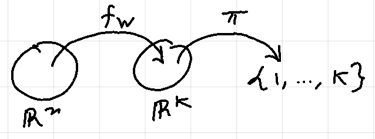
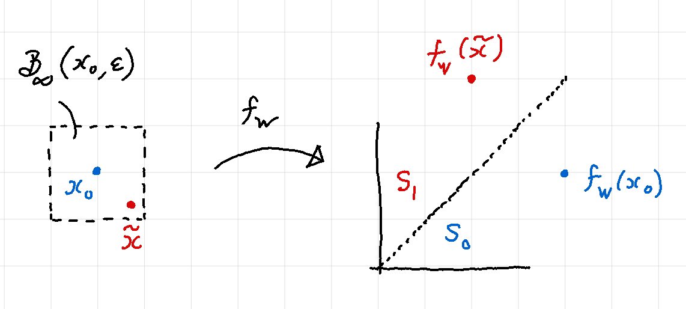

*Robustness* is a desirable property in a neural network. Informally, robustness can be described as 'resilience to perturbations in the input'. Said differently, a neural network is robust if small changes to the input produce small or no changes to the output. In particular, if the network is a classifier, robustness means that inputs close to each other should be assigned the same class by the network. 

Ensuring robustness of networks is important because neural networks are vulnerable to adversarial examples produced by small perturbations in the input. E.g. small changes in the image of a chihuahua can lead a network to [classify it as a chocolate chip muffin](https://www.freecodecamp.org/news/chihuahua-or-muffin-my-search-for-the-best-computer-vision-api-cbda4d6b425d/).

In the subsequent sections, we will make the notion of robustness more precise. We will then explore how we can verify the robustness of a *trained* neural network using a very popular idea from mathematical optimization, viz. *Linear Programming*.

# Problem setup

Suppose we are given a fully connected, feed forward *K-class classifier* neural network that was trained using the ReLU activation function. Note that the weights and biases of this network are fixed. Suppose the network accepts real vectors of length $$n$$ as inputs and let $$F: \mathbb{R}^n \longrightarrow \{1, 2, ..., K\}$$ represent the network classification function. Then we can write $$F$$ as a composition of a *network output function* and a *labeling function* as described below.

Let $$W_i$$ and $$b_i$$ represent the weight matrix and the bias vector of the $$i$$th layer respectively. Then we can write the output of the $$i$$th layer recursively as follows:

$$ \begin{equation} \tag{1}
    z_{i} = \phi(W_{i} z_{i-1} + b_{i}) = \phi \circ \omega_i(z_{i - 1})
\end{equation} $$

where $$\omega_i$$ represents the affine transformation corresponding to the $$i$$th layer and $$\phi$$ represents the "vectorized" version of the activation function, i.e. $$\phi(x_1, ..., x_n) = (\phi(x_1), ..., \phi(x_n))$$. The network output function $$f_W: \mathbb{R}^n \longrightarrow \mathbb{R}^K$$ is defined as:

$$ \begin{equation}\tag{2}
    f_W(x) = \phi \circ \omega_{H+1} \circ \dots \circ \phi \circ \omega_1(x)
\end{equation} $$

where $$H$$ is the number of hidden layers in the network. The labeling function $$\pi: \mathbb{R}^K \longrightarrow \{1, 2, ..., K\}$$ is defined as:

$$ \begin{equation}\tag{3}
\pi(y) = \underset{i = 1, ... , K}{\text{arg max}}\ y_i
\end{equation} $$

where $$K$$ is the number of classes. For a given input $$x_0$$, we have:

$$ \begin{equation}\tag{4}
    F(x_0) = \pi(f_W(x_0)) = l_0
\end{equation} $$

with $$l_0$$ is the class label assigned to $$x_0$$ by the network. It is worth noting that we can use a different labeling function here, e.g. *softmax*, without affecting our analysis as long as the labeling function of choice is non-decreasing.

## Polyhedron induced by a class label

Suppose our classifier network has $$K$$ class labels. The co-domain $$\mathbb{R}^K$$ of the output function can be partitioned into $$K$$ polyhedra. Consider the half-space $$\mathcal{H}_{l > i}$$ of all the points in $$\mathbb{R}^K$$ where the $$l$$th component is greater than the $$i$$th component.

$$\begin{equation}\tag{5}
    \mathcal{H}_{l > i} := \{y \in \mathbb{R}^K : y_l > y_i\}
\end{equation}
$$

Suppose we fix $$l$$ and take the intersection of all half-spaces $$\mathcal{H}_{l > i}$$, $$i \ne l$$. We get the set $$S_l$$ of points where the $$l$$th component is greater than every other component. (For simplicity, we assume that there are no ties among the components of $$y$$, i.e. $$i \ne j \implies y_i \ne y_j$$.)

$$
\begin{equation}\tag{6}
    S_l := \bigcap_{i \ne l} \mathcal{H}_{l > i} = \{y \in \mathbb{R}^K: y_l > y_i, i \ne l\}
\end{equation}
$$

Note that:
* $$S_l$$ is an intersection of half-spaces and is therefore a polyhedron.
* $$S_i \bigcap S_j = \emptyset$$ for $$i \ne j$$.
* $$\{S_1, ..., S_K\}$$ forms a partition of $$\mathbb{R}^K$$.

**Definition** ***\[Polyhedron induced by a class label\].*** *Suppose we are given a K-class classifier network and a class label $$l \in \{1, 2, ..., K\}$$. Then we say that the set*

$$ S_{l} = \{y \in \mathbb{R}^K: y_{l} > y_i, i \ne l\} $$

*is the polyhedron induced by the class label $$l$$.*

**Remark.** The output function maps an input to the corresponding induced polyhedron. Let $$x_0 \in \mathbb{R}^n$$ be an input to a classifier network with classification function $$F$$ and output function $$f_W$$. Then,

$$
\begin{equation*}
     F(x_0) = l_0 \iff f_W(x_0) \subset S_{l_0}
\end{equation*}
$$

In other words, the network assigns the class label $$l_0$$ to the input $$x_0$$ if and only if $$f_W(x_0)$$ lies inside the polyhedron induced by $$l_0$$.

## Formalizing robustness for classifier networks
Recall that we say a classifier network is robust if small perturbations to an input do not affect its classification. Let us define a set that contains all "small" perturbations of the reference input $$x_0$$. We will call this set the *region of interest*. For our purposes, we will choose this set to be the $$\epsilon$$-ball around the refence input $$x_0$$.

**Definition** ***\[Region of inerest around an input\].*** *Let $$x_0 \in \mathbb{R}^n$$ be a reference input. Then the set*

$$\mathcal{B}_{\infty}(x_0, \epsilon) = \{x: \parallel x - x_0 \parallel_{\infty} \le \epsilon \}$$

*is called the region of interest around $$x_0$$.*

**Definition** ***\[Safety set induced by an input\].*** *Suppose the network assigns the class label $$l_0$$ to a reference input $$x_0$$. Then the set $$S_{l_0}$$ is called the safety set induced by $$x_0$$.*

For our network to be robust, it must assign the same class to all points in $$\mathcal{B}_{\infty}(x_0, \epsilon)$$ i.e. $$F(x) = F(x_0) = l_0$$ for all $$x \in \mathcal{B}_{\infty}(x_0, \epsilon)$$. This is equivalent to saying $$f_W(x) \in S_{l_0}$$ for all $$x \in \mathcal{B}_{\infty}(x_0, \epsilon)$$. In other words, we want the image of the region of interest to lie inside the safety set induced by $$x_0$$. The verification problem then reduces to asking the below set membership question:

$$ \begin{equation*}
    f_W(\mathcal{B}_{\infty}(x_0, \epsilon)) \stackrel{?}{\subset} S_{l_0}
\end{equation*} $$

We are now ready to give a formal definition of robustness.

**Definition** ***\[$$\epsilon$$-robustness\].*** *We say that a neural network is $$\epsilon$$-robust at $$x_0$$ if and only if*

$$ \begin{equation*}
    f_W(\mathcal{B}_\infty (x_0, \epsilon)) \subset S_{l_0}
\end{equation*} $$

**Definition** ***\[Adversarial example\].*** *A point $$\tilde{x} \in \mathbb{R}^n$$ is said to be an adversarial example if*

$$ \begin{equation*}
    \tilde{x} \in \mathcal{B}_\infty (x_0, \epsilon),\ \ f_W(\tilde{x}) \notin S_{l_0}
\end{equation*} $$

The two-class classifier network shown in the figure below is not $$\epsilon$$-robust at $$x_0$$ since $$\tilde{x}$$ is an adversarial example.

It is worth noting that a network is $$\epsilon$$-robust if and only if an adversarial example does not exist.

# Verification as an optimization problem
Recall that, given a trained $$H$$-hidden-layer neural network with the output function $$f_W$$, a reference input point $$x_0$$ and a positive $$\epsilon$$, we want to answer the following question:

Does the image of the region of inteterest lie inside the safety set?

$$ \begin{equation*}
    f_W(\mathcal{B}_\infty(x_0, \epsilon)) \stackrel{?}{\subset} S_{l_0}
\end{equation*} $$

Or, equivalently, does there exist an adversarial example?

$$
\begin{equation*}
    \stackrel{?}{\exists} \tilde{x} \in \mathcal{B}_\infty(x_0, \epsilon)\ s.\ t.\ f_W(\tilde{x}) \notin S_{l_0}
\end{equation*}
$$

which is the same as solving the following satisfiability problem in optimization

$$
\begin{gather}\tag{7}
    \text{Find}\ z_0\\
    \text{s.t.}\ z_0 \in \mathcal{B}_\infty(x_0, \epsilon)\\
    z_{H + 1} = f_W(z_0)\\
    z_{H+1} \notin S_{l_0}
\end{gather}
$$

where $$z_0 \in \mathbb{R}^n$$ and $$z_{H+1} \in \mathbb{R}^K$$ are the decision variables. Now, let $$\tilde{z_i}$$ and $$z_i$$ denote the denote the pre- and post-activation output of the $$i$$th layer of the network. In other words

$$
\begin{equation}\tag{eq_z_i_z_i_hat}
    \begin{split}
        \tilde{z_i} &= W_i z_{i -1} + b_i ,\qquad i = 1, ..., H + 1\\
        z_i &= ReLU(\tilde{z_i}), \qquad i = 1, ..., H + 1
    \end{split}
\end{equation}
$$

Then we can replace the constraint $$z_{H+1} = f_W(z_0)$$ in (7) with the equations (eq_z_i_z_i_hat). This gives us the following equivalent form of the satisfiability problem

$$
\begin{gather}
\text{Find}\ z_0\\
\text{s.t.}\ z_0 \in \mathcal{B}_\infty(x_0, \epsilon) \tag{8}\\
\tilde{z_i} = W_i z_{i -1} + b_i \quad i = 1, ..., H + 1 \tag{9}\\
    z_i = ReLU(\tilde{z_i})  \quad i = 1, ..., H + 1 \tag{10}\\
    z_{H+1} \notin S_{l_0} \tag{11}
\end{gather}
$$

where $$z_0, \tilde{z_1}, z_1, \tilde{z_2}, z_2, ..., \tilde{z}_{H+1}, z_{H+1}$$ are the decision variables. We will refer to (8) as the *region of interest constraint*, (9) as the *affine constraint*, (10) as the *ReLU constraint*, and (11) as the *safety set constraint*. We will sometimes refer to (9) and (10) together as the *network constraint* and write it as $$z_{H+1} = f_W(z_0)$$.

Note that if the above optimization problem is feasible then our network is not robust. Conversely, if the problem is infeasible then our network is robust. Also note that the above problem is not a convex optimization problem. This is because, the ReLU and safety set constraints are not convex. This non-convexity of constraints makes it hard to solve the above optimization problem in its current form. Next, we will replace these non-convex constraints with their convex formulations / approximations.

## Convexifying the ReLU constraint.

Note that $$f_W$$ is not a convex function. However, we know that $$f_W$$ is *piece-wise affine*. Suppose we can find a convex set $$\chi' \subset \mathbb{R}^n$$, such that $$f_W$$ is affine on $$\chi'$$. Then, we can replace the network constraint constraint $$z_{H+1} = f_W(z_0)$$ with the following convex approximation:

$$
\begin{equation}\tag{12}
    z_{H+1} = f_W|_{\chi'}(z_0) 
\end{equation}
$$

where $$f_W\mid_{\chi'}$$ is the restriction of $$f_W$$ to $$\chi'$$. But how do we even begin to look for such a $$\chi'$$? As a starting point, it is helpful to note that we want $$\chi' \bigcap \mathcal{B}_\infty(x_0, \epsilon)$$ to be non-empty. This is to ensure that (12) above does not conflict with (8). Said differently, we want $$\chi'$$ to contain $$x_0$$ as well as points that are "close" to $$x_0$$. We will use this idea to find the desired $$\chi'$$.

Observe that as our reference input $$x_0$$ propagates through the network, it causes some neurons to be "activated" in each layer while others remain inactive. For a given input this activation pattern is fixed. Now, the main idea is that *points that are close to $$x_0$$ are likely to produce the same activation pattern as $$x_0$$*. So, it might be useful to look for a set that contains all inputs that produce the same activation pattern as $$x_0$$. Using the notation introduced in (eq_z_i_z_i_hat), the pre- and post-activation outputs of the $$i$$th layer produced by our reference input $$x_0$$ are

$$
\begin{equation*}
    \begin{split}
        \tilde{x}_i &= W_i {x}_{i-1} + b_i ,\qquad i = 1, ..., H + 1\\
        {x}_i &= ReLU(\tilde{x}_i) ,\qquad i = 1, ..., H + 1\\
    \end{split}
\end{equation*}
$$

We say that the $$j$$th neuron in the $$i$$th layer is *activated* by the reference input $$x_0$$ if the $$j$$th component of $$x_i$$ is positive, i.e. $$(x_i)_j > 0$$. The activation status of the $$j$$th neuron in the $$i$$th layer can be described by a binary constant

$$
\begin{equation*}
    \delta_{i,j} =
    \begin{cases}
        1 \quad\text{if}\ (\tilde{x}_i)_j > 0\\
        0 \quad\text{if}\ (\tilde{x}_i)_j \le 0
    \end{cases}
\end{equation*}
$$

The activation pattern of the $$i$$th layer can then be expressed succinctly by the following diagonal matrix

$$
\begin{equation*}
    \Delta_i :=
    \begin{pmatrix}
        \delta_{i,1} & 0 & 0 & 0 & 0\\
        0 & \delta_{i,2} & 0 & 0 & 0\\
        \vdots & \vdots & \vdots & \vdots & \vdots\\
        0 & 0 & 0 & 0 & \delta_{i,d_i}\\
    \end{pmatrix} 
\end{equation*}
$$

where $$d_i$$ is the number of neurons in the $$i$$th layer. Note that the linear operator $$\Delta_i: \mathbb{R}^{d_i} \longrightarrow \mathbb{R}^{d_i}$$ is nothing but a projection map. Now, recall the definition of the network output function $$f_W$$ given in (2) where $$\phi$$ is chosen to be $$ReLU$$. Suppose we were to replace the composition $$\phi \circ \omega_i$$ with the composition $$\Delta_i \circ \omega_i$$ in (2). The resulting output function, $$f_{W_0}$$, is given by

$$
\begin{equation*}\tag{13}
    f_{W_0} = \Delta_{H+1} \circ \omega_{H+1} \circ \dots \circ \Delta_1 \circ \omega_1
\end{equation*}
$$

We make some important observations about $$f_{W_0}$$.

- $$f_{W_0}$$ is an affine function
- $$f_{W_0}(z) = f_W(z)$$ for every $$z$$ that produces the same activation pattern as $$x_0$$.

The first point follows from the fact that $$f_{W_0}$$ is a composition of affine functions. The second point follows from the fact that, in computing the network output, $$f_{W_0}$$ only considers neurons that were activated by the reference input $$x_0$$ and ignores all other neurons (do you see why?). From the above observations, it seems that a good candidate for $$\chi'$$ may be:

$$
\begin{equation*}
\begin{split}
     \chi' &= \{z \in \mathbb{R}^n : z\ \text{produces the same activation pattern as } x_0 \}\\
     &= \{z \in \mathbb{R}^n: f_W(z) = f_{W_0}(z)\}
\end{split}
\end{equation*}
$$

So, finding $$\chi'$$ simply reduces to solving the equation $$f_W(z) = f_{W_0}(z)$$, i.e. 

$$
\begin{equation*}
    \phi \circ \omega_{H+1} \circ \dots \circ \phi \circ \omega_1(z) = \Delta_{H+1} \circ \omega_{H+1} \circ \dots \circ \Delta_1 \circ \omega_1(z)
\end{equation*}
$$

which can be written as

$$
\begin{equation*}
    \phi \circ \omega_i (z_{i-1}) = \Delta_i \circ \omega_i (z_{i - 1})\ ,\ i = 1, ..., H+1
\end{equation*}
$$

which is equivalent to solving for $$z_0, z_1, ..., z_{H+1}$$ in

$$
\begin{equation}\tag{14}
    ReLU(W_i z_{i-1} + b_i) = \Delta_i (W_i z_{i-1} + b_i)\ ,\ i = 1, ..., H+1
\end{equation}
$$

Solving (14) directly is hard. Fortunately, (14) has the below equivalent affine formulation.

$$
\begin{equation}\tag{15}
 (2 \Delta_i - I)(W_i z_{i -1} + b_i) \ge 0\ ,\ i = 1, ..., H+1
\end{equation}
$$

It can be shown that every $$z_0, z_1, ..., z_{H+1}$$ that is a solution to (14) is also a solution to (15) and vice-versa. Substituting $$\tilde{z}_i = W_i z_{i -1} + b_i$$ in (15), we can approximate the ReLU constraint (10) by the following *convex* constraints

$$
\begin{equation*}\tag{eq_convexified_relu}
\begin{split}
    (2 \Delta_i - I)\tilde{z}_i &\ge 0 \\
    z_i = \Delta_i &\tilde{z}_{i}
\end{split}
\end{equation*}
$$

## Convexifying the safety set constraint

Note that the safety set constraint (11) imples that if a feasible solution to our satisfiability problem exists then it must lie outside $$S_{l_0}$$, i.e. it must lie inside $$\mathbb{R}^K \backslash S_{l_0}$$. Recall that $$S_{l_0}$$ is the polyhedron induced by the class label $$l_0$$. In other words, $$S_{l_0}$$ is the set of points where the largest component is at index $$l_0$$. Therefore, $$\mathbb{R}^K \backslash S_{l_0}$$ is the set of points where the largest component is at some index $$l' \ne l_0$$.

Instead of looking everywhere inside $$\mathbb{R}^K \backslash S_{l_0}$$ (which is a non-convex set), we start by looking in the region where the component at index $$l'$$ is greater than the component at index $$l_0$$. This set is simply the half space $$\mathcal{H}_{l_0 < l'}$$. We can now replace (11}) with the below convex constraint:

$$
\begin{equation*}
    z_{H+1} \in \mathcal{H}_{l_0 < l'}
\end{equation*}
$$

Repeating the above process for each $$l' \ne l_0$$ gives us $$K-1$$ convex problems that can be solved easily one at a time.

# Putting it all together
We now write down our original (non-convex) satisfiability problem

$$
\begin{gather*}
    \text{Find}\ z_0\\
    \text{s.t.}\ z_0 \in \mathcal{B}_\infty(x_0, \epsilon)\\
    \tilde{z_i} = W_i z_{i -1} + b_i \qquad &i = 1, ..., H + 1 \\ \tag{Non-Conv}
        z_i = ReLU(\tilde{z_i})  \qquad &i = 1, ..., H + 1 \\
        z_{H+1} \notin S_{l_0}
\end{gather*}
$$

and its convex modification

$$
\begin{gather*}
    \text{Find}\ z_0\\
    \text{s.t.}\ z_0 \in \mathcal{B}_\infty(x_0, \epsilon)\\
    \tilde{z_i} = W_i z_{i -1} + b_i \qquad &i = 1, ..., H + 1 \\ \tag{Conv}
        (2 \Delta_i - I)\tilde{z}_i \ge 0 \qquad &i = 1, ..., H + 1\\
        z_i = \Delta_i \tilde{z}_i  \qquad &i = 1, ..., H + 1 \\
        z_{H+1} \in \mathcal{H}_{l_0 < l'}
\end{gather*}
$$

where (Conv) must be solved $$K -1$$ times with varying $$l'$$. Note that (Conv) is a convex (in fact affine) problem and can be easily solved with the help of any Linear Programming solver.

# Conclusion
In this post we defined the notion of robustness of a neural network and formulated the verificaion of robustness as an optimization problem. We then proposed a convex, LP approximation of this problem which can be solved easily with any linear programming solver. 

It should be noted that the above robustness verification approach of solving a convex approximation of the original problem, is not complete. In other words, the feasibility of the  approximation (Conv) certifies *non-robustness*. However, infeasibility of (Conv) does *not* certify *robustness*. Even so, this approach can be used to quickly determine if a network is certifiably non-robust at a given point by locating an adversarial example. (For an illustration of using the above approach to find adversarial examples check out this [post]().)

# References

[1] Michael Andrew Roark. *Formal Verification of Neural Networks via Optimization Methods.* Masters Thesis (2022). Department of Mathematics, San Francisco State University. URL: https://doi.org/10.46569/20.500.12680/4t64gv41s

[2] Changliu Liu, et al. *Algorithms for Verifying Deep Neural Networks.* (2020) URL: https://arxiv.org/abs/1903.06758

[3] Mahyar Fazlyab, et al. *Safety Verification and Robustness Analysis of Neural Networks via Quadratic Constraints and Semidefinite Programming.* (2021) URL: 
https://doi.org/10.48550/arXiv.1903.01287

