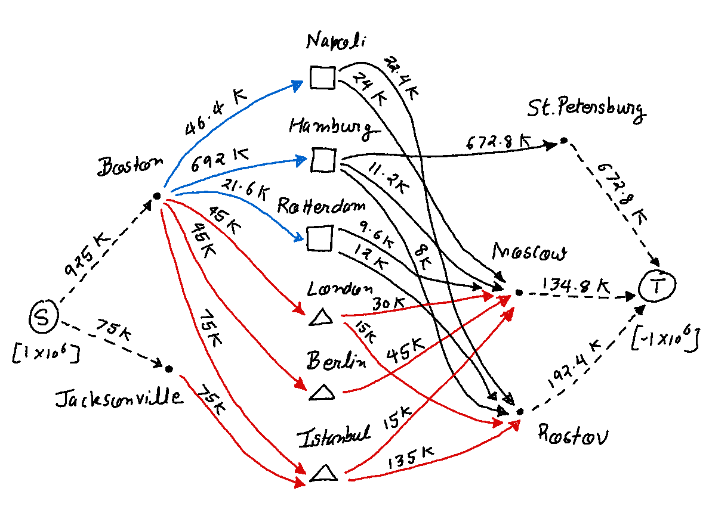
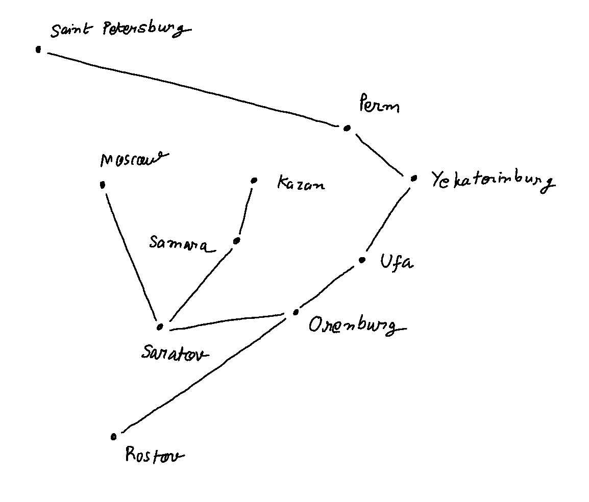

[Source: Frederick S. Hillier and Gerald J. Lieberman.  *Introduction to Operations Research - 7th ed.*, 2000, McGraw-Hill, ISBN 0-07-232169-5]

A rebel army is attempting to overthrow the elected government of the Russian Federation. The United States government has decided to assist its ally by quickly sending troops and supplies to the Federation. A plan needs to be developed for shipping the troops and supplies most effectively. Depending on the overall measure of performance, the analysis requires formulating and solving a shortest-path problem, a minimum cost flow problem, or a maximum flow problem.


-------------------------------------------------------------------------------
Commander Votachev steps into the cold October night and deeply inhales the smoke from his cigarette, savoring its warmth. He surveys the destruction surrounding him — shattered windows, burning buildings, torn roads — and smiles. His two years of work training revolutionaries east of the Ural Mountains has proved successful; his troops now occupy seven strategically important cities in the Russian Federation: Kazan, Perm,Yekaterinburg, Ufa, Samara, Saratov, and Orenburg. His siege is not yet over, however. He looks to the west. Given the political and economic confusion in the Russian Federation at this time, he knows that his troops will be able to conquer Saint Petersburg and Moscow shortly. Commander Votachev will then be able to rule with the wisdom and control exhibited by his communist predecessors Lenin and Stalin.

Across the Pacific Ocean, a meeting of the top security and foreign policy advisers of the United States is in progress at the White House. The President has recently been briefed about the communist revolution masterminded by Commander Votachev and is determining a plan of action. The President reflects upon a similar October long ago in 1917, and he fears the possibility of a new age of radical Communist rule accompanied by chaos, bloodshed, escalating tensions, and possibly nuclear war. He therefore decides that the United States needs to respond and to respond quickly. Moscow has requested assistance from the United States military, and the President plans to send troops and supplies immediately.

The President turns to General Lankletter and asks him to describe the preparations being taken in the United States to send the necessary troops and supplies to the Russian Federation. General Lankletter informs the President that along with troops, weapons, ammunition, fuel, and supplies, aircraft, ships, and vehicles are being assembled at two port cities with airfields: Boston and Jacksonville. The aircraft and ships will transfer all troops and cargo across the Atlantic Ocean to the Eurasian continent. The general hands the President a list of the types of aircraft, ships, and vehicles being assembled along with a description of each type. The list is shown below.

|Transportation Type| Name| Capacity|Speed|
|:---|:---|:---|:---|
|Aircraft|C-141 Starlifter|150 tons|400 miles per hour|
|Ship|Transport|240 tons|35 miles per hour|
|Vehicle|Palletized Load System Truck|16,000 kilograms|60 miles per hour|

- All aircraft, ships, and vehicles are able to carry both troops and cargo.
- Once an aircraft or ship arrives in Europe, it stays there to support the armed forces.

The President then turns to Tabitha Neal, who has been negotiating with the NATO countries for the last several hours to use their ports and airfields as stops to refuel and resupply before heading to the Russian Federation. She informs the President that the following ports and airfields in the NATO countries will be made available to the United States military.

|Ports|Airfields|
|:---|:---|
|Napoli|London|
|Hamburg|Berlin|
|Rotterdam|Istanbul|


The President stands and walks to the map of the world projected on a large screen in the middle of the room. He maps the progress of troops and cargo from the United States to three strategic cities in the Russian Federation that have not yet been seized by Commander Votachev. The three cities are Saint Petersburg, Moscow, and Rostov. He explains that the troops and cargo will be used both to defend the Russian cities and to launch a counterattack against Votachev to recapture the cities he currently occupies. The President also explains that:

- All Starlifters and transports leave either Boston or Jacksonville.
- All transports that have traveled across the Atlantic must dock at one of the NATO ports to unload.
- Palletized load system trucks brought over in the transports will then carry all troops and materials unloaded from the ships at the NATO ports to the three strategic Russian cities not yet seized by Votachev - Saint Petersburg, Moscow, and Rostov.
- All Starlifters that have traveled across the Atlantic must land at one of the NATO airfields for refueling. The planes will then carry all troops and cargo from the NATO airfields to the three Russian cities.


The different routes that may be taken by the troops and supplies to reach the Russian Federation from the United States are shown below:


## Scenario 1: When time is of the essence
### The shortest path problem
Moscow and Washington do not know when Commander Votachev will launch his next attack. Leaders from the two countries have therefore agreed that troops should reach each of the three strategic Russian cities as quickly as possible.

The President has determined that the situation is so dire that cost is no object—as many Starlifters, transports, and trucks as are necessary will be used to transfer troops and cargo from the United States to Saint Petersburg, Moscow, and Rostov. Therefore,no limitations exist on the number of troops and amount of cargo that can be transferred between any cities.

The President has been given the following information about the length of the available routes between cities on the Atlantic leg:

|From|To|Length of route (km)|
|:---|:---|:---:|
|Boston |Berlin |7,250 |
|Boston |Hamburg |8,250 |
|Boston |Istanbul |8,300 |
|Boston |London |6,200 |
|Boston |Rotterdam |6,900 |
|Boston |Napoli |7,950 |
|Jacksonville |Berlin |9,200 |
|Jacksonville |Hamburg |9,800 |
|Jacksonville |Istanbul |10,100 |
|Jacksonville |London |7,900 |
|Jacksonville |Rotterdam |8,900 |
|Jacksonville |Napoli |9,400 |

and on the Eurasian leg:

|From|To|Length of route (km)|
|:---|:---|:---:|
|Berlin | Saint Petersburg |1,280 |
|Hamburg |Saint Petersburg |1,880 |
|Istanbul |Saint Petersburg |2,040 |
|London |Saint Petersburg |1,980 |
|Rotterdam |Saint Petersburg |2,200 |
|Napoli |Saint Petersburg |2,970 |
|Berlin |Moscow |1,600 |
|Hamburg |Moscow |2,120 |
|Istanbul |Moscow |1,700 |
|London |Moscow |2,300 |
|Rotterdam |Moscow |2,450 |
|Napoli |Moscow |2,890 |
|Berlin |Rostov |1,730 |
|Hamburg |Rostov |2,470 |
|Istanbul |Rostov |990 |
|London |Rostov |2,860 |
|Rotterdam |Rostov |2,760 |
|Napoli |Rostov |2,800 |

Given the distance and the speed of the transportation used between each pair of cities, how can the President most quickly move troops from the United States to each of the three strategic Russian cities?

### Dijkstra's shortest path model
Since Question 1 is only concerned with the minimum time taken by the troops to reach Russia, we can model this problem as a *shortest path problem* with each edge length representing the time taken to travel from the source node to the target node. The problem can then be solved using *Dijkstra's shortest path algorithm*. We will use the helper classes and methods provided by the custom [solver](https://github.com/ayusbhar2/operations_research/tree/main/solver) module to solve the problem.


```python
import numpy as np

# my solver module
from solver.algorithms import get_shortest_path
from solver.classes import Edge, Graph
from solver.utils import get_result_summary, get_variable, prettify
```


```python
np.random.seed(6)

AIR_SPEED_KMPH = 400 * 1.60934  # from MPH to KMPH
WATER_SPEED_KMPH = 35 * 1.60934
LAND_SPEED_KMPH = 60 * 1.60934
```


```python
# Create the network graph with provided edges
graph = Graph([
    Edge('Boston', 'Berlin', distance_km=7250, route_type='air'),
    Edge('Boston', 'Hamburg', distance_km=8250, route_type='sea'),
    Edge('Boston', 'Istanbul', distance_km=8300, route_type='air'),
    Edge('Boston', 'London', distance_km=6200, route_type='air'),
    Edge('Boston', 'Rotterdam', distance_km=6900, route_type='sea'),
    Edge('Boston', 'Napoli', distance_km=7950, route_type='sea'),
    Edge('Jacksonville', 'Berlin', distance_km=9200, route_type='air'),
    Edge('Jacksonville', 'Hamburg', distance_km=9800, route_type='sea'),
    Edge('Jacksonville', 'Istanbul', distance_km=10100, route_type='air'),
    Edge('Jacksonville', 'London', distance_km=7900, route_type='air'),
    Edge('Jacksonville', 'Rotterdam', distance_km=8900, route_type='sea'),
    Edge('Jacksonville', 'Napoli', distance_km=9400, route_type='sea'),
    
    Edge('Berlin', 'StPetersburg', distance_km=1280, route_type='air'),
    Edge('Hamburg', 'StPetersburg', distance_km=1880, route_type='land'),
    Edge('Istanbul', 'StPetersburg', distance_km=2040, route_type='air'),
    Edge('London', 'StPetersburg', distance_km=1980, route_type='air'),
    Edge('Rotterdam', 'StPetersburg', distance_km=2200, route_type='land'),
    Edge('Napoli', 'StPetersburg', distance_km=2970, route_type='land'),
    Edge('Berlin', 'Moscow', distance_km=1600, route_type='air'),
    Edge('Hamburg', 'Moscow', distance_km=2120, route_type='land'),
    Edge('Istanbul', 'Moscow', distance_km=1700, route_type='air'),
    Edge('London', 'Moscow', distance_km=2300, route_type='air'),
    Edge('Rotterdam', 'Moscow', distance_km=2450, route_type='land'),
    Edge('Napoli', 'Moscow', distance_km=2890, route_type='land'),
    Edge('Berlin', 'Rostov', distance_km=1730, route_type='air'),
    Edge('Hamburg', 'Rostov', distance_km=2470, route_type='land'),
    Edge('Istanbul', 'Rostov', distance_km=990, route_type='air'),
    Edge('London', 'Rostov', distance_km=2860, route_type='air'),
    Edge('Rotterdam', 'Rostov', distance_km=2760, route_type='land'),
    Edge('Napoli', 'Rostov', distance_km=2800, route_type='land'),
])
```


```python
# Update all edges with a non-negative time-cost
for edge in graph.edges:
    if edge.route_type == 'air':
        time_hr = edge.distance_km / AIR_SPEED_KMPH
    elif edge.route_type == 'sea':
        time_hr = edge.distance_km / WATER_SPEED_KMPH
    else:
        time_hr = edge.distance_km / LAND_SPEED_KMPH
    edge.update(cost=time_hr) # edge cost is needed for shortest path algorithm
```


```python
get_shortest_path(graph, 'Jacksonville', target_name='StPetersburg', algorithm='dijkstra')
```


    (15.347906595250226, ['Jacksonville', 'London', 'StPetersburg'])


```python
get_shortest_path(graph, 'Boston', target_name='StPetersburg', algorithm='dijkstra')
```


    (12.707072464488547, ['Boston', 'London', 'StPetersburg'])


```python
get_shortest_path(graph, 'Jacksonville', target_name='Moscow', algorithm='dijkstra')
```


    (15.845004784570072, ['Jacksonville', 'London', 'Moscow'])


```python
get_shortest_path(graph, 'Boston', target_name='Moscow', algorithm='dijkstra')
```


    (13.204170653808394, ['Boston', 'London', 'Moscow'])


```python
get_shortest_path(graph, 'Jacksonville', target_name='Rostov', algorithm='dijkstra')
```


    (16.7149266158798, ['Jacksonville', 'London', 'Rostov'])


```python
get_shortest_path(graph, 'Boston', target_name='Rostov', algorithm='dijkstra')
```


    (13.949817937788161, ['Boston', 'Berlin', 'Rostov'])


From the above results we see that the fastest way to get troops and supplies to each of the three strategic Russian cities is:

- `Boston --> London --> Saint Petersburg (12.70 hr)`

- `Boston --> London --> Moscow (13.20 hr)`

- `Boston --> Berlin --> Rostov (13.95 hr)`

### The Binary Integer Programming model

We can also model the above problem as a binary integer program as follows.

Parameters:

$$c_{j, k} := \text{ the "cost" associated with edge } (j, k)$$

Variables:

$$x_i:= \begin{cases}
1 \text{ if node i is on the path}\\
0 \text{ otherwise}
\end{cases}$$

$$y_{j, k}:= \begin{cases}
1 \text{ if edge (j, k) is on the path}\\
0 \text{ otherwise}
\end{cases}
$$

Objective:

$$\text{minimize} \sum_{j, k} y_{j, k} c_{j, k}$$

Constraints:

$$x_O := 1 \qquad\text{(Origin constraint)}$$

$$x_T := 1  \qquad\text{(Target constraint)}$$

$$
\sum_{j} y_{j, i} \le 1 + M (1 - x_i)\ , \quad i \ne O \quad \text{(Inbound constraint 1)}\\
\sum_{j} y_{j, i} \ge 1 - M (1 - x_i)\ , \quad i \ne O \quad \text{(Inbound constraint 2)}
$$

$$
\sum_{k} y_{i, k} \le 1 + M (1 - x_i)\ , \quad i \ne T \quad \text{(Outbound constraint 1)}\\
\sum_{k} y_{i, k} \ge 1 - M(1 - x_i)\ , \quad i \ne T \quad \text{(Outbound constraint 2)}
$$

$$
x_j + x_k \ge 2 y_{j, k} \quad \forall\ j, k \quad \text{(Connectivity constraint)}
$$

$$ x_i , y_{j, k} \quad \text{binary}
$$

In order to understand how this formulation would work, let us consider the subgraph with a single source node, viz. Boston, and a single target node, viz. St. Petersburg.


Lets solve the above program with `cvxpy`


```python
import cvxpy as cp
import numpy as np

# my custom solver module
from solver.classes import BinaryIntegerProblem
from solver.algorithms import branch_and_bound
```


```python
#define function for conditional formatting
def cond_formatting(x):
    if type(x) == int or type(x) == float:
        if x > 0:
            return 'background-color: lightgray'
    return None
```


```python
def get_outbound_constraints(vertex_name, graph):
    s = '('
    t = '('
    for edge in graph.get_edges(source_name=vertex_name):
        s += 'y_{}_{} + '.format(edge.source.name, edge.target.name)
        t += 'y_{}_{} + '.format(edge.source.name, edge.target.name)
    s = s[:-2]
    s = s + ') <= 1 + M * (1 - x_{})'.format(vertex_name)
    
    t = t[:-2]
    t = t + ') >= 1 - M * (1 - x_{})'.format(vertex_name)
        
    return s, t
```


```python
def get_inbound_constraints(vertex_name, graph):
    s = '('
    t = '('
    for edge in graph.get_edges(target_name=vertex_name):
        s += 'y_{}_{} + '.format(edge.source.name, edge.target.name)
        t += 'y_{}_{} + '.format(edge.source.name, edge.target.name)
    s = s[:-2]
    s = s + ') <= 1 + M * (1 - x_{})'.format(vertex_name)
    
    t = t[:-2]
    t = t + ') >= 1 - M * (1 - x_{})'.format(vertex_name)
        
    return s, t
```


```python
def get_connectivity_constraints(edge):
    s = 'x_{s} + x_{t} >= 2 * y_{s}_{t}'.format(s=edge.source.name, t=edge.target.name)
    return s    
```


```python
# Parameters

M = 1000000
for edge in graph.edges:
    exec('c_{s}_{t} = edge.cost'.format(s=edge.source.name, t=edge.target.name))
```


```python
# Variables

variables = []
for edge in graph.edges:
    exec('y_{s}_{t} = cp.Variable(1, boolean=True, name="y_{s}_{t}")'.format(
        s=edge.source.name, t=edge.target.name))
    exec('variables.append(y_{s}_{t})'.format(s=edge.source.name, t=edge.target.name))

for vertex in graph.vertices:
    exec('x_{v} = cp.Variable(1, boolean=True, name="x_{v}")'.format(v=vertex.name))
    exec('variables.append(x_{v})'.format(v=vertex.name))
```


```python
# Constraints

constraints_bip = [
    # origin and destination constraints
    x_Boston == 1,
    x_Jacksonville == 0,
    x_StPetersburg == 1,
    x_Moscow == 0,
    x_Rostov == 0,
]

# inbound and outbound constraints
for v in graph.vertices:
    if v.name != 'Boston' and v.name != 'Jacksonville':  # not a source node
        s, t = get_inbound_constraints(v.name, graph)
        constraints_bip.append(eval(s))
        constraints_bip.append(eval(t))
    if v.name != 'StPetersburg' and v.name != 'Moscow' and v.name != 'Rostov':  # not a target node
        s, t = get_outbound_constraints(v.name, graph)
        constraints_bip.append(eval(s))
        constraints_bip.append(eval(t))

# connectivity constraints
for edge in graph.edges:
    s = get_connectivity_constraints(edge)
    constraints_bip.append(eval(s))
```


```python
# Objective

obj_str = ''
for edge in graph.edges:
    obj_str += 'c_{s}_{t} * y_{s}_{t} + '.format(s=edge.source.name, t=edge.target.name)

obj_str = obj_str[:-2]

objective_bip = cp.Minimize(eval(obj_str))
```


```python
# Model

bip = BinaryIntegerProblem(objective_bip, constraints_bip)
```


```python
bip.solve(verbose=True);
```

    ===============================================================================
                                         CVXPY                                     
                                         v1.3.1                                    
    ===============================================================================
    (CVXPY) Jun 07 07:08:40 PM: Your problem has 41 variables, 69 constraints, and 0 parameters.
    (CVXPY) Jun 07 07:08:40 PM: It is compliant with the following grammars: DCP, DQCP
    (CVXPY) Jun 07 07:08:40 PM: (If you need to solve this problem multiple times, but with different data, consider using parameters.)
    (CVXPY) Jun 07 07:08:40 PM: CVXPY will first compile your problem; then, it will invoke a numerical solver to obtain a solution.
    -------------------------------------------------------------------------------
                                      Compilation                                  
    -------------------------------------------------------------------------------
    (CVXPY) Jun 07 07:08:40 PM: Compiling problem (target solver=GLPK_MI).
    (CVXPY) Jun 07 07:08:40 PM: Reduction chain: Dcp2Cone -> CvxAttr2Constr -> ConeMatrixStuffing -> GLPK_MI
    (CVXPY) Jun 07 07:08:40 PM: Applying reduction Dcp2Cone
    (CVXPY) Jun 07 07:08:40 PM: Applying reduction CvxAttr2Constr
    (CVXPY) Jun 07 07:08:40 PM: Applying reduction ConeMatrixStuffing
    (CVXPY) Jun 07 07:08:40 PM: Applying reduction GLPK_MI
    (CVXPY) Jun 07 07:08:40 PM: Finished problem compilation (took 1.239e-01 seconds).
    -------------------------------------------------------------------------------
                                    Numerical solver                               
    -------------------------------------------------------------------------------
    (CVXPY) Jun 07 07:08:40 PM: Invoking solver GLPK_MI  to obtain a solution.
    -------------------------------------------------------------------------------
                                        Summary                                    
    -------------------------------------------------------------------------------      0: obj =   0.000000000e+00 inf =   2.000e+00 (2)
          7: obj =   1.270707246e+01 inf =   0.000e+00 (0)
    *    15: obj =   1.270707246e+01 inf =   0.000e+00 (0)
    +    15: mip =     not found yet >=              -inf        (1; 0)
    +    15: >>>>>   1.270707246e+01 >=   1.270707246e+01   0.0% (1; 0)
    +    15: mip =   1.270707246e+01 >=     tree is empty   0.0% (0; 1)
    
    (CVXPY) Jun 07 07:08:40 PM: Problem status: optimal
    (CVXPY) Jun 07 07:08:40 PM: Optimal value: 1.271e+01
    (CVXPY) Jun 07 07:08:40 PM: Compilation took 1.239e-01 seconds
    (CVXPY) Jun 07 07:08:40 PM: Solver (including time spent in interface) took 8.249e-04 seconds


```python
summary = get_result_summary(bip)
```


```python
summary['status']
```


    'optimal'


```python
summary['optimal_value']
```


    12.707072464488547


```python
df = prettify(summary['optimal_solution'])
```


```python
df.style.applymap(cond_formatting)
```


<style type="text/css">
#T_f391d_row1_col1, #T_f391d_row5_col1, #T_f391d_row10_col1, #T_f391d_row17_col1, #T_f391d_row34_col1 {
  background-color: lightgray;
}
</style>
<table id="T_f391d_">
  <thead>
    <tr>
      <th class="blank level0" >&nbsp;</th>
      <th class="col_heading level0 col0" >variable</th>
      <th class="col_heading level0 col1" >value</th>
    </tr>
  </thead>
  <tbody>
    <tr>
      <th id="T_f391d_level0_row0" class="row_heading level0 row0" >0</th>
      <td id="T_f391d_row0_col0" class="data row0 col0" >x_Berlin</td>
      <td id="T_f391d_row0_col1" class="data row0 col1" >0.000000</td>
    </tr>
    <tr>
      <th id="T_f391d_level0_row1" class="row_heading level0 row1" >1</th>
      <td id="T_f391d_row1_col0" class="data row1 col0" >x_Boston</td>
      <td id="T_f391d_row1_col1" class="data row1 col1" >1.000000</td>
    </tr>
    <tr>
      <th id="T_f391d_level0_row2" class="row_heading level0 row2" >2</th>
      <td id="T_f391d_row2_col0" class="data row2 col0" >x_Hamburg</td>
      <td id="T_f391d_row2_col1" class="data row2 col1" >0.000000</td>
    </tr>
    <tr>
      <th id="T_f391d_level0_row3" class="row_heading level0 row3" >3</th>
      <td id="T_f391d_row3_col0" class="data row3 col0" >x_Istanbul</td>
      <td id="T_f391d_row3_col1" class="data row3 col1" >0.000000</td>
    </tr>
    <tr>
      <th id="T_f391d_level0_row4" class="row_heading level0 row4" >4</th>
      <td id="T_f391d_row4_col0" class="data row4 col0" >x_Jacksonville</td>
      <td id="T_f391d_row4_col1" class="data row4 col1" >0.000000</td>
    </tr>
    <tr>
      <th id="T_f391d_level0_row5" class="row_heading level0 row5" >5</th>
      <td id="T_f391d_row5_col0" class="data row5 col0" >x_London</td>
      <td id="T_f391d_row5_col1" class="data row5 col1" >1.000000</td>
    </tr>
    <tr>
      <th id="T_f391d_level0_row6" class="row_heading level0 row6" >6</th>
      <td id="T_f391d_row6_col0" class="data row6 col0" >x_Moscow</td>
      <td id="T_f391d_row6_col1" class="data row6 col1" >0.000000</td>
    </tr>
    <tr>
      <th id="T_f391d_level0_row7" class="row_heading level0 row7" >7</th>
      <td id="T_f391d_row7_col0" class="data row7 col0" >x_Napoli</td>
      <td id="T_f391d_row7_col1" class="data row7 col1" >0.000000</td>
    </tr>
    <tr>
      <th id="T_f391d_level0_row8" class="row_heading level0 row8" >8</th>
      <td id="T_f391d_row8_col0" class="data row8 col0" >x_Rostov</td>
      <td id="T_f391d_row8_col1" class="data row8 col1" >0.000000</td>
    </tr>
    <tr>
      <th id="T_f391d_level0_row9" class="row_heading level0 row9" >9</th>
      <td id="T_f391d_row9_col0" class="data row9 col0" >x_Rotterdam</td>
      <td id="T_f391d_row9_col1" class="data row9 col1" >0.000000</td>
    </tr>
    <tr>
      <th id="T_f391d_level0_row10" class="row_heading level0 row10" >10</th>
      <td id="T_f391d_row10_col0" class="data row10 col0" >x_StPetersburg</td>
      <td id="T_f391d_row10_col1" class="data row10 col1" >1.000000</td>
    </tr>
    <tr>
      <th id="T_f391d_level0_row11" class="row_heading level0 row11" >11</th>
      <td id="T_f391d_row11_col0" class="data row11 col0" >y_Berlin_Moscow</td>
      <td id="T_f391d_row11_col1" class="data row11 col1" >0.000000</td>
    </tr>
    <tr>
      <th id="T_f391d_level0_row12" class="row_heading level0 row12" >12</th>
      <td id="T_f391d_row12_col0" class="data row12 col0" >y_Berlin_Rostov</td>
      <td id="T_f391d_row12_col1" class="data row12 col1" >0.000000</td>
    </tr>
    <tr>
      <th id="T_f391d_level0_row13" class="row_heading level0 row13" >13</th>
      <td id="T_f391d_row13_col0" class="data row13 col0" >y_Berlin_StPetersburg</td>
      <td id="T_f391d_row13_col1" class="data row13 col1" >0.000000</td>
    </tr>
    <tr>
      <th id="T_f391d_level0_row14" class="row_heading level0 row14" >14</th>
      <td id="T_f391d_row14_col0" class="data row14 col0" >y_Boston_Berlin</td>
      <td id="T_f391d_row14_col1" class="data row14 col1" >0.000000</td>
    </tr>
    <tr>
      <th id="T_f391d_level0_row15" class="row_heading level0 row15" >15</th>
      <td id="T_f391d_row15_col0" class="data row15 col0" >y_Boston_Hamburg</td>
      <td id="T_f391d_row15_col1" class="data row15 col1" >0.000000</td>
    </tr>
    <tr>
      <th id="T_f391d_level0_row16" class="row_heading level0 row16" >16</th>
      <td id="T_f391d_row16_col0" class="data row16 col0" >y_Boston_Istanbul</td>
      <td id="T_f391d_row16_col1" class="data row16 col1" >0.000000</td>
    </tr>
    <tr>
      <th id="T_f391d_level0_row17" class="row_heading level0 row17" >17</th>
      <td id="T_f391d_row17_col0" class="data row17 col0" >y_Boston_London</td>
      <td id="T_f391d_row17_col1" class="data row17 col1" >1.000000</td>
    </tr>
    <tr>
      <th id="T_f391d_level0_row18" class="row_heading level0 row18" >18</th>
      <td id="T_f391d_row18_col0" class="data row18 col0" >y_Boston_Napoli</td>
      <td id="T_f391d_row18_col1" class="data row18 col1" >0.000000</td>
    </tr>
    <tr>
      <th id="T_f391d_level0_row19" class="row_heading level0 row19" >19</th>
      <td id="T_f391d_row19_col0" class="data row19 col0" >y_Boston_Rotterdam</td>
      <td id="T_f391d_row19_col1" class="data row19 col1" >0.000000</td>
    </tr>
    <tr>
      <th id="T_f391d_level0_row20" class="row_heading level0 row20" >20</th>
      <td id="T_f391d_row20_col0" class="data row20 col0" >y_Hamburg_Moscow</td>
      <td id="T_f391d_row20_col1" class="data row20 col1" >0.000000</td>
    </tr>
    <tr>
      <th id="T_f391d_level0_row21" class="row_heading level0 row21" >21</th>
      <td id="T_f391d_row21_col0" class="data row21 col0" >y_Hamburg_Rostov</td>
      <td id="T_f391d_row21_col1" class="data row21 col1" >0.000000</td>
    </tr>
    <tr>
      <th id="T_f391d_level0_row22" class="row_heading level0 row22" >22</th>
      <td id="T_f391d_row22_col0" class="data row22 col0" >y_Hamburg_StPetersburg</td>
      <td id="T_f391d_row22_col1" class="data row22 col1" >0.000000</td>
    </tr>
    <tr>
      <th id="T_f391d_level0_row23" class="row_heading level0 row23" >23</th>
      <td id="T_f391d_row23_col0" class="data row23 col0" >y_Istanbul_Moscow</td>
      <td id="T_f391d_row23_col1" class="data row23 col1" >0.000000</td>
    </tr>
    <tr>
      <th id="T_f391d_level0_row24" class="row_heading level0 row24" >24</th>
      <td id="T_f391d_row24_col0" class="data row24 col0" >y_Istanbul_Rostov</td>
      <td id="T_f391d_row24_col1" class="data row24 col1" >0.000000</td>
    </tr>
    <tr>
      <th id="T_f391d_level0_row25" class="row_heading level0 row25" >25</th>
      <td id="T_f391d_row25_col0" class="data row25 col0" >y_Istanbul_StPetersburg</td>
      <td id="T_f391d_row25_col1" class="data row25 col1" >0.000000</td>
    </tr>
    <tr>
      <th id="T_f391d_level0_row26" class="row_heading level0 row26" >26</th>
      <td id="T_f391d_row26_col0" class="data row26 col0" >y_Jacksonville_Berlin</td>
      <td id="T_f391d_row26_col1" class="data row26 col1" >0.000000</td>
    </tr>
    <tr>
      <th id="T_f391d_level0_row27" class="row_heading level0 row27" >27</th>
      <td id="T_f391d_row27_col0" class="data row27 col0" >y_Jacksonville_Hamburg</td>
      <td id="T_f391d_row27_col1" class="data row27 col1" >0.000000</td>
    </tr>
    <tr>
      <th id="T_f391d_level0_row28" class="row_heading level0 row28" >28</th>
      <td id="T_f391d_row28_col0" class="data row28 col0" >y_Jacksonville_Istanbul</td>
      <td id="T_f391d_row28_col1" class="data row28 col1" >0.000000</td>
    </tr>
    <tr>
      <th id="T_f391d_level0_row29" class="row_heading level0 row29" >29</th>
      <td id="T_f391d_row29_col0" class="data row29 col0" >y_Jacksonville_London</td>
      <td id="T_f391d_row29_col1" class="data row29 col1" >0.000000</td>
    </tr>
    <tr>
      <th id="T_f391d_level0_row30" class="row_heading level0 row30" >30</th>
      <td id="T_f391d_row30_col0" class="data row30 col0" >y_Jacksonville_Napoli</td>
      <td id="T_f391d_row30_col1" class="data row30 col1" >0.000000</td>
    </tr>
    <tr>
      <th id="T_f391d_level0_row31" class="row_heading level0 row31" >31</th>
      <td id="T_f391d_row31_col0" class="data row31 col0" >y_Jacksonville_Rotterdam</td>
      <td id="T_f391d_row31_col1" class="data row31 col1" >0.000000</td>
    </tr>
    <tr>
      <th id="T_f391d_level0_row32" class="row_heading level0 row32" >32</th>
      <td id="T_f391d_row32_col0" class="data row32 col0" >y_London_Moscow</td>
      <td id="T_f391d_row32_col1" class="data row32 col1" >0.000000</td>
    </tr>
    <tr>
      <th id="T_f391d_level0_row33" class="row_heading level0 row33" >33</th>
      <td id="T_f391d_row33_col0" class="data row33 col0" >y_London_Rostov</td>
      <td id="T_f391d_row33_col1" class="data row33 col1" >0.000000</td>
    </tr>
    <tr>
      <th id="T_f391d_level0_row34" class="row_heading level0 row34" >34</th>
      <td id="T_f391d_row34_col0" class="data row34 col0" >y_London_StPetersburg</td>
      <td id="T_f391d_row34_col1" class="data row34 col1" >1.000000</td>
    </tr>
    <tr>
      <th id="T_f391d_level0_row35" class="row_heading level0 row35" >35</th>
      <td id="T_f391d_row35_col0" class="data row35 col0" >y_Napoli_Moscow</td>
      <td id="T_f391d_row35_col1" class="data row35 col1" >0.000000</td>
    </tr>
    <tr>
      <th id="T_f391d_level0_row36" class="row_heading level0 row36" >36</th>
      <td id="T_f391d_row36_col0" class="data row36 col0" >y_Napoli_Rostov</td>
      <td id="T_f391d_row36_col1" class="data row36 col1" >0.000000</td>
    </tr>
    <tr>
      <th id="T_f391d_level0_row37" class="row_heading level0 row37" >37</th>
      <td id="T_f391d_row37_col0" class="data row37 col0" >y_Napoli_StPetersburg</td>
      <td id="T_f391d_row37_col1" class="data row37 col1" >0.000000</td>
    </tr>
    <tr>
      <th id="T_f391d_level0_row38" class="row_heading level0 row38" >38</th>
      <td id="T_f391d_row38_col0" class="data row38 col0" >y_Rotterdam_Moscow</td>
      <td id="T_f391d_row38_col1" class="data row38 col1" >0.000000</td>
    </tr>
    <tr>
      <th id="T_f391d_level0_row39" class="row_heading level0 row39" >39</th>
      <td id="T_f391d_row39_col0" class="data row39 col0" >y_Rotterdam_Rostov</td>
      <td id="T_f391d_row39_col1" class="data row39 col1" >0.000000</td>
    </tr>
    <tr>
      <th id="T_f391d_level0_row40" class="row_heading level0 row40" >40</th>
      <td id="T_f391d_row40_col0" class="data row40 col0" >y_Rotterdam_StPetersburg</td>
      <td id="T_f391d_row40_col1" class="data row40 col1" >0.000000</td>
    </tr>
  </tbody>
</table>


The above result confirms what we already knew from the previous section - the fastest path from Boston to StPetersburg is `Boston --> London --> Saint Petersburg (12.70 hr)`. We can solve similar fomulations for each source-target pair to get the desired results.

It should not come as a surprise that the above problem could be modeled both as a BIP and a Dijkstra's shortest path problem. In fact both these problems are solved using an algorithm that falls into the **Dynamic Programming** paradigm.

It is worth noting that most BIP solvers use some variation of the Branch and Bound algorithm which recursively solves repeated LP relaxations of the original BIP with the simplex method. Since the simplex algorithm is a polynomial time algorithm, the average total running time for the original BIP is close to polynomial in the size of the problem (i.e. number of variables). Let $$N: = $$number of vertices and $$M:=$$ number of edges in the graph. Then, from the above formulation, we note that the total number of variables is $$M + N$$. The average running time of the Branch and Bound algorithm is given by $$O(M + N)^p$$, $$p > 1$$. On the other hand, Dijkstra's shortest path algorithm has a running time of $$O(MN)$$.

However, while the BIP formulation only works for a single source-destination pair at a time, Dijkstra's algorithm can return the shortest path from a source node to *all* the other nodes in a single run. Hence, for larger problems, it may be advantageous to use Dijkstra's algortihm instead of a BIP formulation.


## Scenario 2: When money *is* an object
### A minimum cost flow problem

The President encounters only one problem with his first plan: he has to sell the military deployment to Congress. Under the War Powers Act, the President is required to consult with Congress before introducing troops into hostilities or situations where hostilities will occur. If Congress does not give authorization to the President for such use of troops, the President must withdraw troops after 60 days. Congress also has the power to decrease the 60-day time period by passing a concurrent resolution.

The President knows that Congress will not authorize significant spending for another country’s war, especially when voters have paid so much attention to decreasing the national debt. He therefore decides that he needs to find a way to get the needed troops and supplies to Saint Petersburg, Moscow, and Rostov at the minimum cost.

Each Russian city has contacted Washington to communicate the number of troops and supplies the city needs at a minimum for reinforcement. After analyzing the requests, General Lankletter has converted the requests from numbers of troops, gallons of gasoline, etc., to tons of cargo for easier planning. The requirements are listed below.

|City | Requirements|
|:---|:---|
|Saint Petersburg|320,000 tons|
|Moscow|440,000 tons|
|Rostov|240,000 tons|

Both in Boston and Jacksonville there are 500,000 tons of the necessary cargo available. When the United States decides to send a plane, ship, or truck between two cities, several costs occur—fuel costs, labor costs, maintenance costs, and appropriate port or airfield taxes and tariffs. These costs are listed below.

|From|To|Cost|
|:---|:---|:---|
|Boston|Berlin|\$50,000 per Starlifter|
|Boston|Hamburg|\$30,000 per transport|
|Boston |Istanbul|\$55,000 per Starlifter|
|Boston |London |\$45,000 per Starlifter|
|Boston |Rotterdam |\$30,000 per transport|
|Boston |Napoli |\$32,000 per transport|
|Jacksonville |Berlin |\$57,000 per Starlifter|
|Jacksonville |Hamburg |\$48,000 per transport|
|Jacksonville |Istanbul |\$61,000 per Starlifter|
|Jacksonville |London |\$49,000 per Starlifter|
|Jacksonville |Rotterdam |\$44,000 per transport|
|Jacksonville |Napoli |\$56,000 per transport|
|Berlin |Saint Petersburg |\$24,000 per Starlifter|
|Hamburg |Saint Petersburg |\$3,000 per truck|
|Istanbul |Saint Petersburg |\$28,000 per Starlifter|
|London |Saint Petersburg |\$22,000 per Starlifter|
|Rotterdam |Saint Petersburg |\$3,000 per truck|
|Napoli |Saint Petersburg |\$ 5,000 per truck|
|Berlin |Moscow |\$22,000 per Starlifter|
|Hamburg |Moscow |\$ 4,000 per truck|
|Istanbul |Moscow |\$25,000 per Starlifter|
|London |Moscow |\$19,000 per Starlifter|
|Rotterdam |Moscow |\$ 5,000 per truck|
|Napoli |Moscow |\$ 5,000 per truck|
|Berlin |Rostov |\$23,000 per Starlifter|
|Hamburg |Rostov |\$ 7,000 per truck|
|Istanbul |Rostov |\$ 2,000 per Starlifter|
|London |Rostov |\$ 4,000 per Starlifter|
|Rotterdam |Rostov |\$ 8,000 per truck|
|Napoli |Rostov |\$ 9,000 per truck|

The President faces a number of restrictions when trying to satisfy the requirements. Early winter weather in northern Russia has brought a deep freeze with much snow. Therefore, General Lankletter is opposed to sending truck convoys in the area.

- He convinces the President to supply Saint Petersburg only through the air.
- Moreover, the truck routes into Rostov are quite limited, so that from each port at most 2,500 trucks can be sent to Rostov.
- The Ukrainian government is very sensitive about American airplanes flying through their air space. It restricts the U.S. military to at most 200 flights from Berlin to Rostov and to at most 200 flights from London to Rostov. (The U.S. military does not want to fly around the Ukraine and is thus restricted by the Ukrainian limitations.)

How does the President satisfy each Russian city’s military requirements at minimum cost?

### An LP model

Our scenario lends itself well to a standard minimum cost flow formulation. Boston and Jacksonville are the *supply nodes*, Saint Petersburg, Moscow and Rostov are the *demand nodes* and every other node is a *transshipment node*. Each edge has a cost per unit of cargo associated with it, and some of the edges have maximum capacities as specified in the scenario.


Let us write the mathematical model for this minimum cost flow problem.

Parameters:

$$n := \text{number of nodes in the network}$$

$$c_{i, j}:= \text{cost (\$ / ton) of transportation along (i, j)}$$

$$u_{i, j} := \text{maximum capacity (ton) of the edge (i, j)}$$

$$b_i:= \text{net amount of cargo (tons) generated at node i}$$


Variables:

$$x_{i, j} := \text{tons of cargo transported along the edge (i, j)}$$


Objective:

$$\text{minimize}\ \sum_{i=1}^n \sum_{j=1}^n c_{i, j} x_{i, j}$$

Constraints:

$$\sum_{j=1}^n x_{i,j} - \sum_{j=1}^n x_{j, i} = b_i\ \quad i = 1, ..., n \quad \text{(Node Flow)}$$

$$x_{i, j} \le u_{i, j} \quad \text{(Capacity)}$$ 

$$x_{i, j}\ge 0\quad \text{(Non-negativity)}$$


```python
# cleanup
for edge in graph.edges:
    edge.delete_attr('cost')
```


```python
# Parameters
ROUTE_TYPE_TO_VEHICLE = {
    'air': 'Starlifter',
    'sea': 'Transport',
    'land': 'Truck',
}
VEHICLE_CAPACITY_TONS = {
    'Starlifter':150,
    'Transport': 240,
    'Truck': 16,
}
ROSTOV_TRUCK_NUM_LIMIT = 2500
BERLIN_TO_ROSTOV_FLIGHT_NUM_LIMIT = 200
LONDON_TO_ROSTOV_FLIGHT_NUM_LIMIT = 200

SUPPLY_AT_BOSTON = 500000
SUPPLY_AT_JACKSONVILLE = 500000
DEMAND_AT_STPETERSBURG = 320000
DEMAND_AT_MOSCOW = 440000
DEMAND_AT_ROSTOV = 240000

SUPPLY_NODES = ['Boston', 'Jacksonville']
DEMAND_NODES = ['StPetersburg', 'Moscow', 'Rostov']

EDGE_COSTS_PER_VEHICLE = {
    ('Boston', 'Berlin'): 50000,
    ('Boston', 'Hamburg'): 30000,
    ('Boston', 'Istanbul'): 55000,
    ('Boston', 'London'): 45000,
    ('Boston', 'Rotterdam'): 30000,
    ('Boston', 'Napoli'): 32000,
    ('Jacksonville', 'Berlin'): 57000,
    ('Jacksonville', 'Hamburg'): 48000,
    ('Jacksonville', 'Istanbul'): 61000,
    ('Jacksonville', 'London'): 49000,
    ('Jacksonville', 'Rotterdam'): 44000,
    ('Jacksonville', 'Napoli'): 56000,
    ('Berlin', 'StPetersburg'): 24000,
    ('Hamburg', 'StPetersburg'): 3000,
    ('Istanbul', 'StPetersburg'): 28000,
    ('London', 'StPetersburg'): 22000,
    ('Rotterdam', 'StPetersburg'): 3000,
    ('Napoli', 'StPetersburg'): 5000,
    ('Berlin', 'Moscow'): 22000,
    ('Hamburg', 'Moscow'): 4000,
    ('Istanbul', 'Moscow'): 25000,
    ('London', 'Moscow'): 19000,
    ('Rotterdam', 'Moscow'): 5000,
    ('Napoli', 'Moscow'): 5000,
    ('Berlin', 'Rostov'): 23000,
    ('Hamburg', 'Rostov'): 7000,
    ('Istanbul', 'Rostov'): 2000,
    ('London', 'Rostov'): 4000,
    ('Rotterdam', 'Rostov'): 8000,
    ('Napoli', 'Rostov'): 9000,
}
```


```python
# computing edge costs

for k, c in EDGE_COSTS_PER_VEHICLE.items():  
    edge = graph.get_edge(k[0], k[1])
    cost_per_vehicle = c
    vehicle = ROUTE_TYPE_TO_VEHICLE[edge.route_type]  
    vehicle_capacity_tons = VEHICLE_CAPACITY_TONS[vehicle]
    cost_per_ton = cost_per_vehicle / vehicle_capacity_tons
    edge.update(cost_per_ton=cost_per_ton)
```


```python
# computing edge capacities

## start with infinite edge cpacities
for edge in graph.edges:
    edge.capacity_tons = np.inf
    
## Saint Petersburg is only reachable through air
edges_to_StPetersburg = graph.get_edges(target_name='StPetersburg')
for edge in edges_to_StPetersburg:
    if edge.route_type == 'land':
        edge.update(capacity_tons=0)

## Limited # of trucks to Rostov
edges_to_Rostov = graph.get_edges(target_name='Rostov')
for edge in edges_to_Rostov:
    if edge.route_type == 'land':
        capacity_tons = ROSTOV_TRUCK_NUM_LIMIT * VEHICLE_CAPACITY_TONS['Truck']
        edge.update(capacity_tons=capacity_tons)

## Limited # of flights over Ukrain
edge_Ber_Ros = graph.get_edge('Berlin', 'Rostov')
edge_Ber_Ros.capacity_tons = BERLIN_TO_ROSTOV_FLIGHT_NUM_LIMIT * VEHICLE_CAPACITY_TONS['Starlifter']

edge_Lon_Ros = graph.get_edge('London', 'Rostov')
edge_Lon_Ros.capacity_tons = LONDON_TO_ROSTOV_FLIGHT_NUM_LIMIT * VEHICLE_CAPACITY_TONS['Starlifter']
```


```python
print('Edge | Route_Type | Cost($/ton) | Limit(tons)')
print('---- | ---------- | ----------- | -----------')
for edge in graph.edges:
    print('{s}-{t} | {r} | {c} | {capacity}'.format(
    s=edge.source.name, t=edge.target.name,
        r=edge.route_type, c=np.round(edge.cost_per_ton),
            capacity=edge.capacity_tons
    ))
```

    Edge | Route_Type | Cost($/ton) | Limit(tons)
    ---- | ---------- | ----------- | -----------
    Jacksonville-Istanbul | air | 407.0 | inf
    Hamburg-Rostov | land | 438.0 | 40000
    Jacksonville-Berlin | air | 380.0 | inf
    London-StPetersburg | air | 147.0 | inf
    Hamburg-StPetersburg | land | 188.0 | 0
    London-Rostov | air | 27.0 | 30000
    Napoli-Moscow | land | 312.0 | inf
    Boston-Istanbul | air | 367.0 | inf
    Jacksonville-Rotterdam | sea | 183.0 | inf
    Boston-Berlin | air | 333.0 | inf
    Boston-Napoli | sea | 133.0 | inf
    Jacksonville-Hamburg | sea | 200.0 | inf
    Hamburg-Moscow | land | 250.0 | inf
    Rotterdam-Moscow | land | 312.0 | inf
    Napoli-Rostov | land | 562.0 | 40000
    Istanbul-Moscow | air | 167.0 | inf
    Rotterdam-Rostov | land | 500.0 | 40000
    Boston-London | air | 300.0 | inf
    London-Moscow | air | 127.0 | inf
    Boston-Rotterdam | sea | 125.0 | inf
    Berlin-StPetersburg | air | 160.0 | inf
    Jacksonville-Napoli | sea | 233.0 | inf
    Napoli-StPetersburg | land | 312.0 | 0
    Jacksonville-London | air | 327.0 | inf
    Berlin-Rostov | air | 153.0 | 30000
    Rotterdam-StPetersburg | land | 188.0 | 0
    Berlin-Moscow | air | 147.0 | inf
    Istanbul-Rostov | air | 13.0 | inf
    Istanbul-StPetersburg | air | 187.0 | inf
    Boston-Hamburg | sea | 125.0 | inf


```python
# Variables

variables = []
for edge in graph.edges:
    exec('x_{s}_{t} = cp.Variable(1, nonneg=True, name="x_{s}_{t}")'.format(
        s=edge.source.name, t=edge.target.name))
    exec('variables.append(x_{s}_{t})'.format(
        s=edge.source.name, t=edge.target.name))

[v.name() for v in variables]
```


    ['x_Jacksonville_Istanbul',
     'x_Hamburg_Rostov',
     'x_Jacksonville_Berlin',
     'x_London_StPetersburg',
     'x_Hamburg_StPetersburg',
     'x_London_Rostov',
     'x_Napoli_Moscow',
     'x_Boston_Istanbul',
     'x_Jacksonville_Rotterdam',
     'x_Boston_Berlin',
     'x_Boston_Napoli',
     'x_Jacksonville_Hamburg',
     'x_Hamburg_Moscow',
     'x_Rotterdam_Moscow',
     'x_Napoli_Rostov',
     'x_Istanbul_Moscow',
     'x_Rotterdam_Rostov',
     'x_Boston_London',
     'x_London_Moscow',
     'x_Boston_Rotterdam',
     'x_Berlin_StPetersburg',
     'x_Jacksonville_Napoli',
     'x_Napoli_StPetersburg',
     'x_Jacksonville_London',
     'x_Berlin_Rostov',
     'x_Rotterdam_StPetersburg',
     'x_Berlin_Moscow',
     'x_Istanbul_Rostov',
     'x_Istanbul_StPetersburg',
     'x_Boston_Hamburg']


```python
# Objective

obj_str = ''
for edge in graph.edges:
    cost = edge.cost_per_ton
    obj_str += '+ {c} * x_{s}_{t}'.format(s=edge.source.name, t=edge.target.name, c=cost)
    
exec('obj_min_cost_flow = cp.Minimize({})'.format(obj_str))
```


```python
# Constraints

## flow constraints

node_flow_constraints = []
for v in graph.vertices:
    if v.name == 'Boston':  # supply node
        b = SUPPLY_AT_BOSTON
    elif v.name == 'Jacksonville':  # supply node
        b = SUPPLY_AT_JACKSONVILLE
    elif v.name == 'StPetersburg':  # demand node
        b =  -1 * DEMAND_AT_STPETERSBURG
    elif v.name == 'Moscow':  # demand node
        b = -1 * DEMAND_AT_MOSCOW
    elif v.name == 'Rostov':  # demand node
        b = -1 * DEMAND_AT_ROSTOV
    else:
        b = 0  # transshipment node
    v.add_attr(b=b)
        
    constr_out_str = ''
    constr_in_str = ''
    # outbound
    if v.name not in DEMAND_NODES:
        for edge in graph.get_edges(source_name=v.name):
            constr_out_str += 'x_{s}_{t} + '.format(
                s=v.name, t=edge.target.name)
        constr_out_str = constr_out_str[:-2] 
    # inbound
    if v.name not in SUPPLY_NODES:
        constr_in_str = ''
        for edge in graph.get_edges(target_name=v.name):
            constr_in_str += ' - x_{s}_{t}'.format(s=edge.source.name, t=v.name)

    constr_str = constr_out_str + constr_in_str + ' == {}'.format(b)
    constr = eval(constr_str)
    node_flow_constraints.append(constr)
    
## edge capacity constraints

capacity_constraints = []
for edge in graph.edges:
    constr = eval('x_{s}_{t} <= edge.capacity_tons'.format(
        s=edge.source.name, t=edge.target.name))
    capacity_constraints.append(constr)
```

Note that the above problem satisfies the **Feasible Solution Property** of minimum cost flow problems. viz. the problem has a feasible solution only if $$\sum_{i = 1}^n b_i = 0$$. Clearly in our case, this is true because the total supply at Boston and Jacksonville is equal to the total demand at St Petersburg, Moscow and Rostov, viz. $$500,000$$ tons.

It is also worth noting that we do not need to restrict $$x_{i, j}$$ to be integers. This follows from the **Integer Solutions Property** of minimum cost flow problems. This property implies that if $$b_i$$ and $$u_{i, j}$$ are integers, then so is every feasible solution of the problem. Hence, we can get away by formulating the above problem as a Linear Program and not an Integer Program! 


```python
# Model
prob_min_cost_flow = cp.Problem(obj_min_cost_flow, node_flow_constraints + capacity_constraints)
prob_min_cost_flow.solve(solver=cp.GLPK, verbose=True)
```

    ===============================================================================
                                         CVXPY                                     
                                         v1.3.1                                    
    ===============================================================================
    (CVXPY) Jun 07 07:08:40 PM: Your problem has 30 variables, 41 constraints, and 0 parameters.
    (CVXPY) Jun 07 07:08:40 PM: It is compliant with the following grammars: DCP, DQCP
    (CVXPY) Jun 07 07:08:40 PM: (If you need to solve this problem multiple times, but with different data, consider using parameters.)
    (CVXPY) Jun 07 07:08:40 PM: CVXPY will first compile your problem; then, it will invoke a numerical solver to obtain a solution.
    -------------------------------------------------------------------------------
                                      Compilation                                  
    -------------------------------------------------------------------------------
    (CVXPY) Jun 07 07:08:40 PM: Compiling problem (target solver=GLPK).
    (CVXPY) Jun 07 07:08:40 PM: Reduction chain: Dcp2Cone -> CvxAttr2Constr -> ConeMatrixStuffing -> GLPK
    (CVXPY) Jun 07 07:08:40 PM: Applying reduction Dcp2Cone
    (CVXPY) Jun 07 07:08:40 PM: Applying reduction CvxAttr2Constr
    (CVXPY) Jun 07 07:08:40 PM: Applying reduction ConeMatrixStuffing
    (CVXPY) Jun 07 07:08:40 PM: Applying reduction GLPK
    (CVXPY) Jun 07 07:08:40 PM: Finished problem compilation (took 1.044e-01 seconds).
    -------------------------------------------------------------------------------
                                    Numerical solver                               
    -------------------------------------------------------------------------------
    (CVXPY) Jun 07 07:08:40 PM: Invoking solver GLPK  to obtain a solution.
    -------------------------------------------------------------------------------
                                        Summary                                    
    -------------------------------------------------------------------------------
    (CVXPY) Jun 07 07:08:40 PM: Problem status: optimal
    GLPK Simplex Optimizer 5.0
    71 rows, 30 columns, 120 non-zeros
          0: obj =               nan inf =   2.000e+06 (5)
          5: obj =               nan inf =   0.000e+00 (0)
    *    31: obj =               nan inf =   0.000e+00 (0)
    OPTIMAL LP SOLUTION FOUND
    (CVXPY) Jun 07 07:08:40 PM: Optimal value: 4.129e+08
    (CVXPY) Jun 07 07:08:40 PM: Compilation took 1.044e-01 seconds
    (CVXPY) Jun 07 07:08:40 PM: Solver (including time spent in interface) took 7.927e-04 seconds


    412866666.6666666


```python
summary = get_result_summary(prob_min_cost_flow)
```


```python
summary['status']
```


    'optimal'


```python
summary['optimal_value']
```


    412866666.6666666


```python
df = prettify(summary['optimal_solution'])
df[df.value>0]
```


<div>
<style scoped>
    .dataframe tbody tr th:only-of-type {
        vertical-align: middle;
    }

    .dataframe tbody tr th {
        vertical-align: top;
    }

    .dataframe thead th {
        text-align: right;
    }
</style>
<table border="1" class="dataframe">
  <thead>
    <tr style="text-align: right;">
      <th></th>
      <th>variable</th>
      <th>value</th>
    </tr>
  </thead>
  <tbody>
    <tr>
      <th>4</th>
      <td>x_Boston_Hamburg</td>
      <td>440000.0</td>
    </tr>
    <tr>
      <th>5</th>
      <td>x_Boston_Istanbul</td>
      <td>60000.0</td>
    </tr>
    <tr>
      <th>9</th>
      <td>x_Hamburg_Moscow</td>
      <td>440000.0</td>
    </tr>
    <tr>
      <th>13</th>
      <td>x_Istanbul_Rostov</td>
      <td>210000.0</td>
    </tr>
    <tr>
      <th>17</th>
      <td>x_Jacksonville_Istanbul</td>
      <td>150000.0</td>
    </tr>
    <tr>
      <th>18</th>
      <td>x_Jacksonville_London</td>
      <td>350000.0</td>
    </tr>
    <tr>
      <th>22</th>
      <td>x_London_Rostov</td>
      <td>30000.0</td>
    </tr>
    <tr>
      <th>23</th>
      <td>x_London_StPetersburg</td>
      <td>320000.0</td>
    </tr>
  </tbody>
</table>
</div>


Hence we conclude that the United States can meet the cargo requirements at three Russian cities at a minimum cost of **\$ 412,866,667** while honoring all the specified restrictions. The corresponding optimal solution is shown below:
 

## Scenario 3: When you cannot do everything, do the best you can!
### A maximum flow problem

Once the President releases the number of planes, ships, and trucks that will travel between the United States and the Russian Federation, Tabitha Neal contacts each of the American cities and NATO countries to indicate the number of planes to expect at the airfields, the number of ships to expect at the docks, and the number of trucks to expect traveling across the roads. Unfortunately, Tabitha learns that several additional restrictions exist which cannot be immediately eliminated. Because of airfield congestion and unalterable flight schedules, only a limited number of planes may be sent between any two cities. These plane limitations are given below.

|From |To |Maximum|
|:---|:---|:---|
|Boston |Berlin |300 airplanes|
|Boston |Istanbul |500 airplanes|
|Boston |London |500 airplanes|
|Jacksonville |Berlin |500 airplanes|
|Jacksonville |Istanbul |700 airplanes|
|Jacksonville |London |600 airplanes|
|Berlin |Saint Petersburg |500 airplanes|
|Istanbul |Saint Petersburg |0 airplanes|
|London |Saint Petersburg |1,000 airplanes|
|Berlin |Moscow |300 airplanes|
|Istanbul |Moscow |100 airplanes|
|London |Moscow |200 airplanes|
|Berlin |Rostov |0 airplanes|
|Istanbul |Rostov |900 airplanes|
|London |Rostov |100 airplanes|

In addition, because some countries fear that citizens will become alarmed if too many military trucks travel the public highways, they object to a large number of trucks traveling through their countries. These objections mean that a limited number of trucks are able to travel between certain ports and Russian cities. These limitations are listed below.

|From | To | Maximum|
|:--- |:--- |:--- |
|Rotterdam | Moscow | 600 trucks
|Rotterdam | Rostov | 750 trucks
|Hamburg | Moscow | 700 trucks
|Hamburg | Rostov | 500 trucks
|Napoli | Moscow | 1,500 trucks
|Napoli | Rostov | 1,400 trucks

Tabitha learns that all shipping lanes have no capacity limits, owing to the American control of the Atlantic Ocean.
The President realizes that because of all the restrictions **he will not be able to satisfy all the reinforcement requirements of the three Russian cities**. He decides to disregard the cost issue and instead to maximize the total amount of cargo he can get to the Russian cities.

How does the President maximize the total amount of cargo that reaches the Russian Federation?

### An LP formulation

The current scenario appears very similar to the standard *Maximum Flow* problem where we want to maximize the flow through a network while honoring the capacity of each edge in the network. Next, we note that **the maximum flow problem is just a special case of the minimum cost flow problem** and we can reuse the model in the previous section with the following modifications.
1. We add a new Source node $$S$$ with total supply of 1 million tons and a new target node $$T$$ with total demand of 1 million tons.
2. We add a direct edge from the $$S$$ to $$T$$ with infinite cost and infinite capacity.
3. We assign zero cost to all edges in the network except the edge $$S$$-->$$T$$.


```python
M = 1.0e10
SUPPLY_UPPER_BOUND_TONS = 1000000
```


```python
# Add fictitious source and target
graph.add_edge(Edge('S', 'Boston'))
graph.add_edge(Edge('S', 'Jacksonville'))

graph.add_edge(Edge('StPetersburg', 'T'))
graph.add_edge(Edge('Moscow', 'T'))
graph.add_edge(Edge('Rostov', 'T'))

# Add a direct edge from the  𝑆 to  𝑇
graph.add_edge(Edge('S', 'T'))
```


```python
# Make all edge costs zero
for edge in graph.edges:
    edge.update(cost_per_ton=0)
    
# Assign infinite cost to S-->T
s_t = graph.get_edge('S', 'T')
s_t.update(cost_per_ton=M)
```


```python
# Initialize all edge capacities to infinity
for edge in graph.edges:
    edge.update(capacity_vehicle_units=np.inf)
    edge.update(capacity_tons=np.inf)
    
# Assign edge cpacities in vehicle count and tons
EDGE_CAPACITIES_IN_VEHICLE_NUMS = {
    ('Boston', 'Berlin'): 300,
    ('Boston', 'Istanbul'): 500,
    ('Boston', 'London'): 500,
    ('Jacksonville', 'Berlin'): 500,
    ('Jacksonville', 'Istanbul'): 700,
    ('Jacksonville', 'London'): 600,
    ('Berlin', 'StPetersburg'): 500,
    ('Istanbul', 'StPetersburg'): 0,
    ('London', 'StPetersburg'): 1000,
    ('Berlin', 'Moscow'): 300,
    ('Istanbul', 'Moscow'): 100,
    ('London', 'Moscow'): 200,
    ('Berlin', 'Rostov'): 0,
    ('Istanbul', 'Rostov'): 900,
    ('London', 'Rostov'): 100,

    ('Rotterdam', 'Moscow'): 600,
    ('Rotterdam', 'Rostov'): 750,
    ('Hamburg', 'Moscow'): 700,
    ('Hamburg', 'Rostov'): 500,
    ('Napoli', 'Moscow'): 1500,
    ('Napoli', 'Rostov'): 1400,
}
for k, c in EDGE_CAPACITIES_IN_VEHICLE_NUMS.items():
    edge = graph.get_edge(k[0], k[1])
    edge.capacity_vehicle_units = c

    vehicle = ROUTE_TYPE_TO_VEHICLE[edge.route_type]
    vehicle_capacity_tons = VEHICLE_CAPACITY_TONS[vehicle]

    edge_capacity_tons = edge.capacity_vehicle_units * vehicle_capacity_tons
    edge.update(capacity_tons=edge_capacity_tons)
```


```python
# Variables
variables = []
for edge in graph.edges:
    exec('x_{s}_{t} = cp.Variable(1, nonneg=True, name="x_{s}_{t}")'.format(
        s=edge.source.name, t=edge.target.name))
    exec('variables.append(x_{s}_{t})'.format(
        s=edge.source.name, t=edge.target.name))

sorted([v.name() for v in variables])
```


    ['x_Berlin_Moscow',
     'x_Berlin_Rostov',
     'x_Berlin_StPetersburg',
     'x_Boston_Berlin',
     'x_Boston_Hamburg',
     'x_Boston_Istanbul',
     'x_Boston_London',
     'x_Boston_Napoli',
     'x_Boston_Rotterdam',
     'x_Hamburg_Moscow',
     'x_Hamburg_Rostov',
     'x_Hamburg_StPetersburg',
     'x_Istanbul_Moscow',
     'x_Istanbul_Rostov',
     'x_Istanbul_StPetersburg',
     'x_Jacksonville_Berlin',
     'x_Jacksonville_Hamburg',
     'x_Jacksonville_Istanbul',
     'x_Jacksonville_London',
     'x_Jacksonville_Napoli',
     'x_Jacksonville_Rotterdam',
     'x_London_Moscow',
     'x_London_Rostov',
     'x_London_StPetersburg',
     'x_Moscow_T',
     'x_Napoli_Moscow',
     'x_Napoli_Rostov',
     'x_Napoli_StPetersburg',
     'x_Rostov_T',
     'x_Rotterdam_Moscow',
     'x_Rotterdam_Rostov',
     'x_Rotterdam_StPetersburg',
     'x_S_Boston',
     'x_S_Jacksonville',
     'x_S_T',
     'x_StPetersburg_T']


```python
# Objective
obj_str = ''
for edge in sorted(graph.edges, key=lambda x: x.source.name):
    obj_str += '+ {c} * x_{s}_{t}'.format(
        s=edge.source.name, t=edge.target.name, c=edge.cost_per_ton)
    
exec('obj_max_flow = cp.Minimize({})'.format(obj_str))
```


```python
print(obj_max_flow)
```

    minimize 0.0 @ x_Berlin_StPetersburg + 0.0 @ x_Berlin_Rostov + 0.0 @ x_Berlin_Moscow + 0.0 @ x_Boston_Istanbul + 0.0 @ x_Boston_Berlin + 0.0 @ x_Boston_Napoli + 0.0 @ x_Boston_London + 0.0 @ x_Boston_Rotterdam + 0.0 @ x_Boston_Hamburg + 0.0 @ x_Hamburg_Rostov + 0.0 @ x_Hamburg_StPetersburg + 0.0 @ x_Hamburg_Moscow + 0.0 @ x_Istanbul_Moscow + 0.0 @ x_Istanbul_Rostov + 0.0 @ x_Istanbul_StPetersburg + 0.0 @ x_Jacksonville_Istanbul + 0.0 @ x_Jacksonville_Berlin + 0.0 @ x_Jacksonville_Rotterdam + 0.0 @ x_Jacksonville_Hamburg + 0.0 @ x_Jacksonville_Napoli + 0.0 @ x_Jacksonville_London + 0.0 @ x_London_StPetersburg + 0.0 @ x_London_Rostov + 0.0 @ x_London_Moscow + 0.0 @ x_Moscow_T + 0.0 @ x_Napoli_Moscow + 0.0 @ x_Napoli_Rostov + 0.0 @ x_Napoli_StPetersburg + 0.0 @ x_Rostov_T + 0.0 @ x_Rotterdam_Moscow + 0.0 @ x_Rotterdam_Rostov + 0.0 @ x_Rotterdam_StPetersburg + 10000000000.0 @ x_S_T + 0.0 @ x_S_Jacksonville + 0.0 @ x_S_Boston + 0.0 @ x_StPetersburg_T


```python
# Constraints
## Update the node flow constraints
node_flow_constraints = []
for v in sorted(graph.vertices, key=lambda x: x.name):
    if v.name == 'S':  # supply node
        b = SUPPLY_UPPER_BOUND_TONS
    elif v.name == 'T':  # demand node
        b =  -1 * SUPPLY_UPPER_BOUND_TONS
    else:
        b = 0  # transshipment node
    v.add_attr(b=b)
    print('{}'.format(v))
    
    constr_out_str = ''
    constr_in_str = ''
    # outbound
    if v.name != 'T':
        for edge in graph.get_edges(source_name=v.name):
            constr_out_str += 'x_{s}_{t} + '.format(
                s=v.name, t=edge.target.name)
        constr_out_str = constr_out_str[:-2] 
    # inbound
    if v.name != 'S':
        constr_in_str = ''
        for edge in graph.get_edges(target_name=v.name):
            constr_in_str += ' - x_{s}_{t}'.format(s=edge.source.name, t=v.name)

    constr_str = constr_out_str + constr_in_str + ' == {}'.format(b)
    constr = eval(constr_str)
    node_flow_constraints.append(constr)
    print('{}\n'.format(constr))   
```

    Vertex: Berlin
    x_Berlin_StPetersburg + x_Berlin_Rostov + x_Berlin_Moscow + -x_Jacksonville_Berlin + -x_Boston_Berlin == 0.0
    
    Vertex: Boston
    x_Boston_Istanbul + x_Boston_Berlin + x_Boston_Napoli + x_Boston_London + x_Boston_Rotterdam + x_Boston_Hamburg + -x_S_Boston == 0.0
    
    Vertex: Hamburg
    x_Hamburg_Rostov + x_Hamburg_StPetersburg + x_Hamburg_Moscow + -x_Jacksonville_Hamburg + -x_Boston_Hamburg == 0.0
    
    Vertex: Istanbul
    x_Istanbul_Moscow + x_Istanbul_Rostov + x_Istanbul_StPetersburg + -x_Jacksonville_Istanbul + -x_Boston_Istanbul == 0.0
    
    Vertex: Jacksonville
    x_Jacksonville_Istanbul + x_Jacksonville_Berlin + x_Jacksonville_Rotterdam + x_Jacksonville_Hamburg + x_Jacksonville_Napoli + x_Jacksonville_London + -x_S_Jacksonville == 0.0
    
    Vertex: London
    x_London_StPetersburg + x_London_Rostov + x_London_Moscow + -x_Boston_London + -x_Jacksonville_London == 0.0
    
    Vertex: Moscow
    x_Moscow_T + -x_Napoli_Moscow + -x_Hamburg_Moscow + -x_Rotterdam_Moscow + -x_Istanbul_Moscow + -x_London_Moscow + -x_Berlin_Moscow == 0.0
    
    Vertex: Napoli
    x_Napoli_Moscow + x_Napoli_Rostov + x_Napoli_StPetersburg + -x_Boston_Napoli + -x_Jacksonville_Napoli == 0.0
    
    Vertex: Rostov
    x_Rostov_T + -x_Hamburg_Rostov + -x_London_Rostov + -x_Napoli_Rostov + -x_Rotterdam_Rostov + -x_Berlin_Rostov + -x_Istanbul_Rostov == 0.0
    
    Vertex: Rotterdam
    x_Rotterdam_Moscow + x_Rotterdam_Rostov + x_Rotterdam_StPetersburg + -x_Jacksonville_Rotterdam + -x_Boston_Rotterdam == 0.0
    
    Vertex: S
    x_S_T + x_S_Jacksonville + x_S_Boston == 1000000.0
    
    Vertex: StPetersburg
    x_StPetersburg_T + -x_London_StPetersburg + -x_Hamburg_StPetersburg + -x_Berlin_StPetersburg + -x_Napoli_StPetersburg + -x_Rotterdam_StPetersburg + -x_Istanbul_StPetersburg == 0.0
    
    Vertex: T
    -x_StPetersburg_T + -x_S_T + -x_Moscow_T + -x_Rostov_T == -1000000.0
    


```python
## Update the edge capacity constraints
capacity_constraints = []
for edge in sorted(graph.edges, key=lambda x: x.source.name):
    constr = eval('x_{s}_{t} <= edge.capacity_tons'.format(
        s=edge.source.name, t=edge.target.name))
    capacity_constraints.append(constr)
    print(constr)
```

    x_Berlin_StPetersburg <= 75000.0
    x_Berlin_Rostov <= 0.0
    x_Berlin_Moscow <= 45000.0
    x_Boston_Istanbul <= 75000.0
    x_Boston_Berlin <= 45000.0
    x_Boston_Napoli <= inf
    x_Boston_London <= 75000.0
    x_Boston_Rotterdam <= inf
    x_Boston_Hamburg <= inf
    x_Hamburg_Rostov <= 8000.0
    x_Hamburg_StPetersburg <= inf
    x_Hamburg_Moscow <= 11200.0
    x_Istanbul_Moscow <= 15000.0
    x_Istanbul_Rostov <= 135000.0
    x_Istanbul_StPetersburg <= 0.0
    x_Jacksonville_Istanbul <= 105000.0
    x_Jacksonville_Berlin <= 75000.0
    x_Jacksonville_Rotterdam <= inf
    x_Jacksonville_Hamburg <= inf
    x_Jacksonville_Napoli <= inf
    x_Jacksonville_London <= 90000.0
    x_London_StPetersburg <= 150000.0
    x_London_Rostov <= 15000.0
    x_London_Moscow <= 30000.0
    x_Moscow_T <= inf
    x_Napoli_Moscow <= 24000.0
    x_Napoli_Rostov <= 22400.0
    x_Napoli_StPetersburg <= inf
    x_Rostov_T <= inf
    x_Rotterdam_Moscow <= 9600.0
    x_Rotterdam_Rostov <= 12000.0
    x_Rotterdam_StPetersburg <= inf
    x_S_T <= inf
    x_S_Jacksonville <= inf
    x_S_Boston <= inf
    x_StPetersburg_T <= inf


```python
prob_max_flow = cp.Problem(obj_max_flow, node_flow_constraints + capacity_constraints)
```


```python
prob_max_flow.solve(solver=cp.GLPK, verbose=True)
```

    ===============================================================================
                                         CVXPY                                     
                                         v1.3.1                                    
    ===============================================================================
    (CVXPY) Jun 07 07:08:41 PM: Your problem has 36 variables, 49 constraints, and 0 parameters.
    (CVXPY) Jun 07 07:08:41 PM: It is compliant with the following grammars: DCP, DQCP
    (CVXPY) Jun 07 07:08:41 PM: (If you need to solve this problem multiple times, but with different data, consider using parameters.)
    (CVXPY) Jun 07 07:08:41 PM: CVXPY will first compile your problem; then, it will invoke a numerical solver to obtain a solution.
    -------------------------------------------------------------------------------
                                      Compilation                                  
    -------------------------------------------------------------------------------
    (CVXPY) Jun 07 07:08:41 PM: Compiling problem (target solver=GLPK).
    (CVXPY) Jun 07 07:08:41 PM: Reduction chain: Dcp2Cone -> CvxAttr2Constr -> ConeMatrixStuffing -> GLPK
    (CVXPY) Jun 07 07:08:41 PM: Applying reduction Dcp2Cone
    (CVXPY) Jun 07 07:08:41 PM: Applying reduction CvxAttr2Constr
    (CVXPY) Jun 07 07:08:41 PM: Applying reduction ConeMatrixStuffing
    (CVXPY) Jun 07 07:08:41 PM: Applying reduction GLPK
    (CVXPY) Jun 07 07:08:41 PM: Finished problem compilation (took 1.826e-01 seconds).
    -------------------------------------------------------------------------------
                                    Numerical solver                               
    -------------------------------------------------------------------------------
    (CVXPY) Jun 07 07:08:41 PM: Invoking solver GLPK  to obtain a solution.
    GLPK Simplex Optimizer 5.0
    85 rows, 36 columns, 144 non-zeros
    -------------------------------------------------------------------------------
                                        Summary                                    
    -------------------------------------------------------------------------------
    (CVXPY) Jun 07 07:08:41 PM: Problem status: optimal
          0: obj =               nan inf =   2.000e+06 (2)
          1: obj =               nan inf =   0.000e+00 (0)
    *    27: obj =               nan inf =   0.000e+00 (0)
    OPTIMAL LP SOLUTION FOUND
    (CVXPY) Jun 07 07:08:41 PM: Optimal value: 0.000e+00
    (CVXPY) Jun 07 07:08:41 PM: Compilation took 1.826e-01 seconds
    (CVXPY) Jun 07 07:08:41 PM: Solver (including time spent in interface) took 8.690e-04 seconds


    0.0


```python
summary = get_result_summary(prob_max_flow)
```


```python
summary['status']
```


    'optimal'


```python
summary['optimal_value']
```


    0.0


```python
df = prettify(summary['optimal_solution'])
df[df.value > 0].sort_values(by='variable')
```


<div>
<style scoped>
    .dataframe tbody tr th:only-of-type {
        vertical-align: middle;
    }

    .dataframe tbody tr th {
        vertical-align: top;
    }

    .dataframe thead th {
        text-align: right;
    }
</style>
<table border="1" class="dataframe">
  <thead>
    <tr style="text-align: right;">
      <th></th>
      <th>variable</th>
      <th>value</th>
    </tr>
  </thead>
  <tbody>
    <tr>
      <th>0</th>
      <td>x_Berlin_Moscow</td>
      <td>45000.0</td>
    </tr>
    <tr>
      <th>3</th>
      <td>x_Boston_Berlin</td>
      <td>45000.0</td>
    </tr>
    <tr>
      <th>4</th>
      <td>x_Boston_Hamburg</td>
      <td>692000.0</td>
    </tr>
    <tr>
      <th>5</th>
      <td>x_Boston_Istanbul</td>
      <td>75000.0</td>
    </tr>
    <tr>
      <th>6</th>
      <td>x_Boston_London</td>
      <td>45000.0</td>
    </tr>
    <tr>
      <th>7</th>
      <td>x_Boston_Napoli</td>
      <td>46400.0</td>
    </tr>
    <tr>
      <th>8</th>
      <td>x_Boston_Rotterdam</td>
      <td>21600.0</td>
    </tr>
    <tr>
      <th>9</th>
      <td>x_Hamburg_Moscow</td>
      <td>11200.0</td>
    </tr>
    <tr>
      <th>10</th>
      <td>x_Hamburg_Rostov</td>
      <td>8000.0</td>
    </tr>
    <tr>
      <th>11</th>
      <td>x_Hamburg_StPetersburg</td>
      <td>672800.0</td>
    </tr>
    <tr>
      <th>12</th>
      <td>x_Istanbul_Moscow</td>
      <td>15000.0</td>
    </tr>
    <tr>
      <th>13</th>
      <td>x_Istanbul_Rostov</td>
      <td>135000.0</td>
    </tr>
    <tr>
      <th>17</th>
      <td>x_Jacksonville_Istanbul</td>
      <td>75000.0</td>
    </tr>
    <tr>
      <th>21</th>
      <td>x_London_Moscow</td>
      <td>30000.0</td>
    </tr>
    <tr>
      <th>22</th>
      <td>x_London_Rostov</td>
      <td>15000.0</td>
    </tr>
    <tr>
      <th>24</th>
      <td>x_Moscow_T</td>
      <td>134800.0</td>
    </tr>
    <tr>
      <th>25</th>
      <td>x_Napoli_Moscow</td>
      <td>24000.0</td>
    </tr>
    <tr>
      <th>26</th>
      <td>x_Napoli_Rostov</td>
      <td>22400.0</td>
    </tr>
    <tr>
      <th>28</th>
      <td>x_Rostov_T</td>
      <td>192400.0</td>
    </tr>
    <tr>
      <th>29</th>
      <td>x_Rotterdam_Moscow</td>
      <td>9600.0</td>
    </tr>
    <tr>
      <th>30</th>
      <td>x_Rotterdam_Rostov</td>
      <td>12000.0</td>
    </tr>
    <tr>
      <th>32</th>
      <td>x_S_Boston</td>
      <td>925000.0</td>
    </tr>
    <tr>
      <th>33</th>
      <td>x_S_Jacksonville</td>
      <td>75000.0</td>
    </tr>
    <tr>
      <th>35</th>
      <td>x_StPetersburg_T</td>
      <td>672800.0</td>
    </tr>
  </tbody>
</table>
</div>


The optimal soution is shown below



Points to note:
- The total cargo (1 million tons) shipped from the US reaches the Russian Federation.
- However, as expected, the individual requirements of the three cities from the previous scenario could not be satisfied. E.g. the total cargo reaching Rostov is 192,400 tons while the cargo requirement at Rostov from the previous scenario was 240,000 tons.
- The above optimal solution is not unique. In other words, ignoring all costs, there are other ways to send all of the cargo from US to the Russian Federation.

Hence, we conclude that if the President could choose to ignore the edge costs and the individual city requirements in the interest of making sure that all the intended cargo reaches the Russian Federation, the above solution will accomplish that. However, a logical question is: *what would the above solution cost?*

In order to answer this question, we use the edge costs specified in the previous scenario.


```python
for k, c in EDGE_COSTS_PER_VEHICLE.items():  
    edge = graph.get_edge(k[0], k[1])
    cost_per_vehicle = c
    vehicle = ROUTE_TYPE_TO_VEHICLE[edge.route_type]  
    vehicle_capacity_tons = VEHICLE_CAPACITY_TONS[vehicle]
    cost_per_ton = cost_per_vehicle / vehicle_capacity_tons
    edge.update(cost_per_ton=cost_per_ton)
```


```python
obj_str = ''
for edge in graph.edges:
    cost = edge.cost_per_ton
    obj_str += '+ {c} * x_{s}_{t}'.format(s=edge.source.name, t=edge.target.name, c=cost)
    
exec('obj_min_cost_flow = cp.Minimize({})'.format(obj_str))
```


```python
obj_min_cost_flow.value
```


    358536666.6666666


As seen above, the optimal solution for the maximum cost flow problem shown above has a cost of **\$ 358,536,667**. By contrast, the optimal solution to the minimum cost flow model is **\$ 412,866,667**. This may seem counterintuitive because we expect that trying to minimize the total cost should give a smaller optimal value. However, the reason for the above disparity is that in the minimum cost flow problem, we were trying to satisfy the demand constraints at each of the three demand nodes - Saint Petersburg, Moscow and Rostov. However, in the maximum flow problem, we relaxed these constraints and were able to achieve an overall cheaper solution!

## Scenario 4: Re-establishing communications

### A minimum spanning tree (MST) problem
Even before all American troops and supplies had reached Saint Petersburg, Moscow, and Rostov, infighting among Commander Votachev’s troops about whether to make the next attack against Saint Petersburg or against Moscow split the revolutionaries. Troops from Moscow easily overcame the vulnerable revolutionaries. Commander Votachev was imprisoned, and the next step became rebuilding the seven cities razed by his armies.

The President’s top priority is to help the Russian government to reestablish communications between the seven Russian cities and Moscow at minimum cost. The price of installing communication lines between any two Russian cities varies given the cost of shipping wire to the area, the level of destruction in the area, and the roughness of the terrain.
Luckily, a city is able to communicate with all others if it is connected only indirectly to every other city. Saint Petersburg and Rostov are already connected to Moscow, so if any of the seven cities is connected to Saint Petersburg or Rostov, it will also be connected to Moscow. The cost of replacing communication lines between two given cities for which this is possible is shown below.

|Between | Cost(\$) |
|:---|---:|
|Saint Petersburg and Kazan | 210,000|
|Saint Petersburg and Perm | 185,000|
|Saint Petersburg and Ufa | 225,000|
|Moscow and Ufa | 310,000|
|Moscow and Samara | 195,000|
|Moscow and Orenburg | 440,000|
|Moscow and Saratov | 140,000|
|Rostov and Saratov | 200,000|
|Rostov and Orenburg | 120,000|
|Kazan and Perm | 150,000|
|Kazan and Ufa | 105,000|
|Kazan and Samara | 95,000|
|Perm and Yekaterinburg | 85,000|
|Perm and Ufa | 125,000|
|Yekaterinburg and Ufa | 125,000|
|Ufa and Samara | 100,000|
|Ufa and Orenburg |  75,000|
|Saratov and Samara | 100,000|
|Saratov and Orenburg |  95,000|

The minimum spanning tree problem can be solved in multiple ways. One way is to set it up as a Binary Integer Programming problem and then use a Branch and Bound algorithm to solve it. (We will see how this formulation works later.)

A more efficient way, especially for larger problems with sparse graphs, is to use the specialized minimum spanning tree (MST) algorithm which is more lightweight and well suited for an MST problem in the standard form (which is the case for us.) We will directly use the custom implementation of the MST algorithm from the `solver` module.

### The MST algorithm


```python
edge_list = [
    Edge('StPetersburg',  'Kazan', cost=210000),
    Edge('StPetersburg',  'Perm', cost=185000),
    Edge('StPetersburg',  'Ufa', cost=225000),
    Edge('Moscow',  'Ufa', cost=310000),
    Edge('Moscow',  'Samara', cost=195000),
    Edge('Moscow',  'Orenburg', cost=440000),
    Edge('Moscow',  'Saratov', cost=140000),
    Edge('Rostov',  'Saratov', cost=200000),
    Edge('Rostov',  'Orenburg', cost=120000),
    Edge('Kazan',  'Perm', cost=150000),
    Edge('Kazan',  'Ufa', cost=105000),
    Edge('Kazan',  'Samara', cost=95000),
    Edge('Perm',  'Yekaterinburg', cost=85000),
    Edge('Perm',  'Ufa', cost=125000),
    Edge('Yekaterinburg',  'Ufa', cost=125000),
    Edge('Ufa',  'Samara', cost=100000),
    Edge('Ufa',  'Orenburg', cost=75000),
    Edge('Saratov',  'Samara', cost=100000),
    Edge('Saratov',  'Orenburg', cost=95000),
]
graph = Graph(edge_list)
```


```python
# make it an undirected graph
for edge in edge_list:
    reverse_edge = Edge(
        edge.target.name, edge.source.name, cost=edge.cost)
    graph.add_edge(reverse_edge)
```


```python
for v in graph.vertices:
    print(v)
```

    Vertex: Kazan
    Vertex: Samara
    Vertex: Perm
    Vertex: StPetersburg
    Vertex: Orenburg
    Vertex: Rostov
    Vertex: Moscow
    Vertex: Saratov
    Vertex: Ufa
    Vertex: Yekaterinburg


```python
from solver.algorithms import get_minimum_spanning_tree

tree = get_minimum_spanning_tree(graph, key_attr='cost')
total_cost = sum(edge.cost for edge in tree.edges)
```


```python
for edge in tree.edges:
    print(edge, edge.cost)
```

    Edge: Ufa->Yekaterinburg 125000
    Edge: Perm->StPetersburg 185000
    Edge: Orenburg->Ufa 75000
    Edge: Kazan->Samara 95000
    Edge: Saratov->Moscow 140000
    Edge: Yekaterinburg->Perm 85000
    Edge: Samara->Saratov 100000
    Edge: Orenburg->Rostov 120000
    Edge: Saratov->Orenburg 95000


The Minimum Spanning Tree is shown below:




```python
total_cost
```


    1020000


### The BIP (cutset) formulation of MST 

Given the undirected graph, we can formulate the MST problem as a BIP. Shown below is one of multiple ways this can be done. This particular formulation is called the *cutset* formulation.

Parameters:

$$c_{i, j}:= \text{ Cost associated with edge (i, j)}$$

Variables:

$$y_{i, j}:= \begin{cases}1 \text{ if edge (i, j) is chosen}\\0 \text{ otherwise}\end{cases}$$

Objective:

$$\text{Minimize }\sum_{i=1}^n \sum_{j = 1}^n c_{i,j} y_{i, j}$$

Constraints:

$$y_{i, j} = y_{j, i}\quad , \forall\ i, j\qquad \text{(Symmetry)}$$

$$\sum_{i=1}^n \sum_{j=1}^n y_{i, j} = 2 (n - 1)\qquad \text{(Tree)}$$

$$\sum_{(i, j)\  \in \ \delta(S)} y_{j, i} \ge 1 \quad , \forall\ S \subset V, S\ne V, S \ne \emptyset \quad \text{(Connectivity)}$$

where $$V$$ the set of vertices of the graph, and $$\delta(S)$$ is the *cutset* of S containing edges that have one end in $$S$$ and the other in $$V \backslash S$$.

It is worth noting that the number of connectivity constraints equals the total number of non-empty, proper subsets $$S$$ of $$V$$. This number is precisely $$2^n - 2$$ where $$n = \mid V \mid$$. As we can see, **the number of connectivity constraints grows exponentially with the number of vertices in the graph**. This makes the BIP formulation of the MST practically intractable and we will not go any further with this approach.

# References

Notebook available at:

https://github.com/ayusbhar2/optimization/blob/main/applications/network_optimization/network_optimization.ipynb
